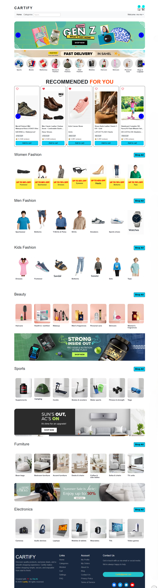

## Table of Contents

- [Project Overview](#project-overview)
- [Getting Started](#getting-started)
- [Key Features](#key-features)
- [Tech Stack](#tech-stack)
- [System Architecture](#system-architecture)
- [Backend Architecture](#backend-architecture)
- [Frontend Architecture](#frontend-architecture)
- [Database Architecture](#database-architecture)
- [Feature Documentation](#feature-documentation)
- [Security](#security)
- [API Overview](#api-overview)
- [Database Setup](#database-setup)
- [Configure Backend Settings](#3-configure-backend-settings)
- [Install Frontend Dependencies](#6-install-frontend-dependencies)
- [Local Development Setup](#local-development-setup)
- [Demo / Screenshots](#Demo--Screenshots)
- [Live Demo](#live-demo)
- [Screenshots](#screenshots)
- [Test Payment](#test-payment)
- [Testing](#testing)
- [Known Limitations](#known-limitations)
- [Future Improvements](#future-improvements)
- [Project Structure](#project-structure)
- [Author](#author)

# E-Commerce Full-Stack Application

A full-stack e-commerce application built with **ASP.NET Core Web API**, **C#**, **React**, **TypeScript**, and **SQL Server**.

## The project follows a **3-Tier Architecture** on the backend and a **feature-based architecture** on the frontend, with **Redux Toolkit** for state management and **Stripe** for payment processing.

## Project Overview

This project is a full-stack e-commerce application designed to simulate a real-world online shopping experience while demonstrating practical full-stack development skills across the frontend, backend, and database layers.

The application allows users to browse products and categories, search and filter products, manage their shopping cart and wishlist, complete checkout and payments, and manage their personal account and orders.

### User Experience

Users can browse the application and explore products without creating an account. However, authentication is required to access account-specific features such as:

- Shopping Cart
- Checkout
- Wishlist
- Profile

Unauthenticated users can still register, log in, and use the **Forgot Password / Reset Password** functionality when needed.

After logging in, users can manage their account through:

- Dashboard
- Personal Information
- Addresses
- Payment Methods
- Orders
- Settings

### Product Browsing

The application provides a hierarchical product catalog organized into categories, subcategories, and deeper levels of subcategories.

Users can:

- Browse products by category.
- Navigate through nested product categories.
- Search for products by name.
- Filter products based on available criteria.
- Browse products using pagination.

The application supports two pagination approaches:

- Traditional pagination using **Previous** and **Next** navigation.
- Incremental loading while scrolling through search/filter results.

### Shopping & Checkout

Authenticated users can add products to their cart, manage cart items, and proceed through the checkout process.

The checkout flow includes order information, shipping details, saved payment methods, promotional codes, and payment processing.

Payments are integrated with **Stripe** using Stripe's test environment for demonstration purposes.

### Order Management

After completing a purchase, users can view and manage their orders through their account.

The system stores order and payment information and updates the order status according to the payment process.

**Planned:** Order tracking functionality is planned for a future version of the application.

### Project Goal

## The primary goal of this project is to demonstrate the practical application of full-stack development skills by building a realistic e-commerce application that combines frontend development, backend API development, database design, authentication, authorization, CRUD operations, payment processing, and user account management in a single application.

## Getting Started

Follow these steps to run the project locally.

### Prerequisites

Make sure the following tools are installed:

- **Node.js** — v22.11.0 or a compatible version
- **.NET 8 SDK** — required to build and run the backend
- **Microsoft SQL Server**
- **SQL Server Management Studio (SSMS)**
- **Stripe CLI**
- **Git**
- **Visual Studio 2022** — required to run the ASP.NET Core backend

### 1. Clone the Repository

Clone the repository and navigate to the project directory:

```bash
git clone <REPOSITORY_URL>
cd <PROJECT_DIRECTORY>
```

### 2. Set Up the Database

Create and configure the SQL Server database required by the application.

Follow the detailed instructions in the [Database Setup](#database-setup) section.

### 3. Configure and Run the Backend

Configure the required backend settings, including:

- JWT configuration
- Stripe configuration
- Brevo SMTP configuration
- Frontend base URL

Follow the detailed instructions in the [Configure Backend Settings](#3-configure-backend-settings) section.

Open the ASP.NET Core backend project in **Visual Studio 2022** and run it using the **Start/Run** button.

### 4. Install Frontend Dependencies

Follow the detailed instructions in the [Install Frontend Dependencies](#6-install-frontend-dependencies) section.

### 5. Run the Application

Start the frontend and Stripe CLI using:

```bash
npm run dev:full
```

Make sure the ASP.NET Core backend is running at:

```text
https://localhost:7163
```

The frontend will be available at:

```text
http://localhost:5173
```

### 6. Verify the Setup

Once the application is running:

1. Open the frontend in your browser at:

```text
http://localhost:5173
```

2. Verify that products and categories load correctly.
3. Test authentication and other main features.
4. For payment testing, use Stripe Test Mode and the provided test card.

For detailed Stripe payment and testing instructions, see the [Test Payment](#test-payment) and [Testing](#testing) sections.

## Key Features

- User registration and login
- JWT-based authentication and authorization
- Protected routes for authenticated users
- Product browsing and hierarchical category navigation
- Product search and filtering
- Traditional pagination with Previous / Next navigation
- Infinite scrolling with incremental loading for search and filter results
- Shopping cart management
- Wishlist management
- Checkout and order creation
- Stripe payment integration using Stripe Test Mode
- Stripe webhook integration for payment confirmation
- Order management
- User dashboard
- Personal information management
- Address management
- Saved payment methods
- Promo code support
- Password change
- Forgot Password / Reset Password flow with email-based reset links
- Responsive e-commerce user interface
- CRUD operations across the application

## Tech Stack

### Backend

- **C#**
- **.NET 8**
- **ASP.NET Core Web API**
- **3-Tier Architecture**
- **JWT Authentication & Authorization**
- **BCrypt** for password hashing
- **ADO.NET** for database access
- **MailKit / MimeKit** for email delivery
- **Brevo SMTP** for email service integration
- **Stripe** for payment processing
- **Stripe Webhooks**
- **Swagger / OpenAPI** for API documentation and testing

### Frontend

- **React**
- **TypeScript**
- **Redux Toolkit** for state management
- **Redux Persist** for state persistence
- **React Router** for client-side routing
- **Axios** for API communication
- **React Hook Form** for form management
- **Vite** for development and build tooling
- **Zod** for schema validation
- **Material UI (MUI)**
- **Bootstrap / React Bootstrap**
- **Stripe.js** for payment integration
- **Responsive UI**
- **Feature-Based Architecture**

### Database

- **Microsoft SQL Server**
- **Stored Procedures**
- **Relational Database Design**
- **Parameterized Database Operations**

### Payment & Integrations

- **Stripe Test Mode** for payment processing
- **Stripe.js** for client-side payment integration
- **Stripe CardElement** for card payment collection
- **PaymentIntent** for payment processing
- **Saved Stripe Payment Methods**
- **Stripe Webhooks** for payment confirmation and order updates
- **Stripe CLI** for local webhook testing
- **Brevo SMTP** for email service integration

## System Architecture

The application follows a **3-Tier Architecture** on the backend and a **Feature-Based Architecture** on the frontend.

### High-Level Architecture

```text
┌──────────────────────────────────────┐
│          Frontend Application        │
│                                      │
│   React + TypeScript                 │
│   Feature-Based Architecture         │
│   Redux Toolkit + Redux Persist      │
│   React Router                       │
│   Axios                              │
└──────────────────┬───────────────────┘
                   │
                   │ HTTP / REST API
                   ▼
┌──────────────────────────────────────┐
│         ASP.NET Core Web API         │
│                                      │
│   Controllers / API Layer            │
└──────────────────┬───────────────────┘
                   │
                   ▼
┌──────────────────────────────────────┐
│            Business Layer            │
│                                      │
│   Business Logic                     │
│   Validation & Application Rules     │
└──────────────────┬───────────────────┘
                   │
                   ▼
┌──────────────────────────────────────┐
│         Data Access Layer            │
│                                      │
│   ADO.NET                            │
│   Stored Procedure Execution         │
└──────────────────┬───────────────────┘
                   │
                   ▼
┌──────────────────────────────────────┐
│             SQL Server               │
│                                      │
│   Relational Database                │
│   Stored Procedures                  │
└──────────────────────────────────────┘
```

### External Integrations

```
                         ┌───────────────┐
                         │    Stripe     │
                         │   Payments    │
                         └───────┬───────┘
                                 │
                                 │
┌──────────────┐       ┌────────▼────────┐
│              │       │                 │
│    React     │──────▶│ ASP.NET Core API│
│   Frontend   │       │                 │
│              │       └────────┬────────┘
└──────────────┘                │
                                │
                         ┌──────▼──────┐
                         │   Business  │
                         │    Layer    │
                         └──────┬──────┘
                                │
                         ┌──────▼──────┐
                         │     DAL     │
                         └──────┬──────┘
                                │
                         ┌──────▼──────┐
                         │ SQL Server  │
                         └─────────────┘

                         ┌───────────────┐
                         │  Brevo SMTP   │
                         │ Email Service │
                         └───────────────┘
```

### Architecture Overview

- The **React frontend** provides the user interface and manages client-side application state.
- **Redux Toolkit** manages application state, while **Redux Persist** maintains selected state across browser sessions.
- **Axios** is used to communicate with the ASP.NET Core REST API.
- The **ASP.NET Core Web API** handles HTTP requests, authentication, authorization, and API endpoints.
- The **Business Layer** contains the application's business logic and application rules.
- The **Data Access Layer** handles database communication using **ADO.NET** and **Stored Procedures**.
- **SQL Server** stores the application's relational data.
- **Stripe** is integrated for payment processing and payment confirmation through webhooks.
- **Brevo SMTP** is integrated for email-related functionality.

## Backend Architecture

The backend follows a **3-Tier Architecture** that separates HTTP/API handling, business logic, and database access into independent layers.

### Architecture Flow

```text
┌──────────────────────────────────────┐
│          API / Controller Layer      │
│                                      │
│  HTTP Endpoints                      │
│  Authentication & Authorization      │
│  Request / Response DTOs             │
│  Input Validation                    │
│  HTTP Status Codes                   │
└──────────────────┬───────────────────┘
                   │
                   ▼
┌──────────────────────────────────────┐
│            Business Layer            │
│                                      │
│  Business Rules & Validation         │
│  Authentication & JWT Generation     │
│  Password Hashing & Verification     │
│  Cart & Wishlist Operations          │
│  Search & Pagination Coordination    │
│  Checkout & Order Processing         │
│  Promo Code Validation               │
│  Payment Workflow                    │
└──────────────────┬───────────────────┘
                   │
                   ▼
┌──────────────────────────────────────┐
│          Data Access Layer           │
│                                      │
│  Database Communication              │
│  ADO.NET                             │
│  Stored Procedure Execution          │
│  CRUD Operations                     │
│  Data Retrieval & Persistence        │
└──────────────────┬───────────────────┘
                   │
                   ▼
┌──────────────────────────────────────┐
│             SQL Server               │
│                                      │
│  Relational Data                     │
│  Stored Procedures                   │
└──────────────────────────────────────┘
```

### API / Controller Layer

The API layer exposes the application's REST API and handles HTTP communication between the frontend and backend.

Key responsibilities include:

- Defining HTTP endpoints for application features.
- Receiving request DTOs and returning response DTOs.
- Validating incoming request parameters.
- Handling authentication and authorization requirements.
- Extracting authenticated user information from JWT claims.
- Applying endpoint-level access restrictions.
- Returning appropriate HTTP status codes and API responses.
- Delegating application operations to the Business Layer.

### Business Layer

The Business Layer contains the application's core business logic and application-level rules.

Key responsibilities include:

- Implementing business rules and application logic.
- Handling user registration and login workflows.
- Generating JWT authentication tokens.
- Hashing and verifying passwords using **BCrypt**.
- Handling Forgot Password and Reset Password workflows.
- Managing cart and wishlist operations.
- Coordinating product search and pagination.
- Managing user profile and account-related operations.
- Managing addresses and saved payment methods.
- Validating promo codes and calculating discounts.
- Validating product availability and stock during checkout.
- Calculating subtotal, shipping, tax, discounts, and final order amounts.
- Creating orders and coordinating payment processing.
- Creating Stripe PaymentIntents.
- Handling post-payment order completion.

### Data Access Layer

The Data Access Layer handles communication between the Business Layer and SQL Server.

Key responsibilities include:

- Establishing SQL Server database connections.
- Executing **Stored Procedures** using **ADO.NET**.
- Performing CRUD operations.
- Retrieving and persisting application data.
- Passing parameters to database operations.
- Mapping database results into DTOs and application data structures.
- Handling paginated product retrieval and pagination metadata.
- Managing database transactions where required.

### Pagination Flow

Pagination is implemented across multiple backend layers as part of the product retrieval workflow.

```text
Frontend
   │
   │ categoryId + pageNumber + pageSize
   ▼
API / Controller Layer
   │
   │ validates pagination parameters
   ▼
Business Layer
   │
   │ coordinates product retrieval
   ▼
Data Access Layer
   │
   │ executes paginated stored procedure
   ▼
SQL Server
   │
   │ products + pagination metadata
   ▼
Data Access Layer
   │
   │ maps database results to DTOs
   ▼
Business Layer
   │
   ▼
API / Controller Layer
   │
   ▼
Frontend
```

The pagination workflow returns both the requested products and pagination metadata, including:

- Current page
- Page size
- Total products
- Total pages
- Previous-page availability
- Next-page availability

The API layer also applies pagination defaults and prevents excessively large page sizes.

### Separation of Responsibilities

The three layers communicate through clearly defined responsibilities:

```text
Controller Layer
      │
      │ Handles HTTP requests
      ▼
Business Layer
      │
      │ Applies business rules
      ▼
Data Access Layer
      │
      │ Performs database operations
      ▼
SQL Server
```

This separation keeps HTTP handling, business rules, and database operations independent, making the backend easier to maintain, extend, and modify as new features are introduced.

## Frontend Architecture

The frontend follows a **Feature-Based Architecture**, where application code is organized around business features rather than grouping all components, APIs, and state logic into separate global folders.

This structure keeps each feature's UI components, pages, API logic, state management, validation, and styles close to the feature they belong to.

### Project Structure

```text
src/
├── app/
│   ├── protectedRoute/
│   ├── routes/
│   └── store/
│
├── assets/
│   ├── aboutUs/
│   ├── Advertisements/
│   ├── Blog/
│   ├── categories/
│   ├── contactUs/
│   ├── HomeCategoriesCarousel/
│   ├── MainHomeCarousel/
│   ├── lottieFiles/
│   └── svg/
│
├── config/
│   ├── api.ts
│   └── api/
│       └── axios.ts
│
├── features/
│   ├── about_us/
│   ├── auth/
│   ├── blog/
│   ├── cart/
│   ├── categories/
│   ├── checkout/
│   ├── contact_us/
│   ├── home/
│   ├── layout/
│   ├── privacy_policy/
│   ├── products/
│   ├── profile/
│   ├── promo/
│   ├── search/
│   ├── swiper/
│   ├── terms_of_service/
│   └── wishlist/
│
├── shared/
│   ├── BackToTop/
│   ├── constants/
│   ├── hooks/
│   ├── LottieHandler/
│   ├── Skeletons/
│   ├── ui/
│   └── utils/
│
├── FrameWork.css
├── index.css
├── main.tsx
├── swiper.d.ts
└── vite-env.d.ts
```

### Feature Structure

Each major application feature contains the files and folders related to its own functionality.

For example, the **authentication feature** is organized as follows:

```text
features/
└── auth/
    ├── AuthChoice/
    ├── Form/
    ├── Login/
    ├── Register/
    ├── validations/
    ├── authAPI.ts
    ├── authSlice.ts
    └── auth.module.css
```

The **checkout feature** follows a similar structure:

```text
features/
└── checkout/
    ├── Components/
    ├── Pages/
    ├── validations/
    ├── checkoutAPI.ts
    ├── checkoutSlice.ts
    ├── checkout.module.css
    └── index.ts
```

Other major features are organized in the same way, including:

- `products`
- `categories`
- `cart`
- `wishlist`
- `profile`
- `orders` functionality inside `profile`
- `promo`
- `search`
- `home`
- `auth`
- `checkout`

### Application Layer

The `app/` directory contains application-level configuration and infrastructure.

```text
app/
├── App.tsx
├── eventBus.ts
├── hooks.ts
├── protectedRoute/
├── routes/
└── store/
```

It contains:

- Application entry and composition through `App.tsx`.
- Global application hooks.
- Redux store configuration.
- Application routing.
- Protected route handling.
- Global event handling such as logout events.

### Configuration

The `config/` directory contains API-related configuration and Axios setup.

```text
config/
├── api.ts
└── api/
    └── axios.ts
```

This keeps API configuration and HTTP client setup separate from individual features.

### Shared Resources

The `shared/` directory contains reusable functionality that is not specific to a single business feature.

```text
shared/
├── BackToTop/
├── constants/
├── hooks/
├── LottieHandler/
├── Skeletons/
├── ui/
└── utils/
```

Examples include:

- Reusable UI components.
- Shared hooks.
- Common constants.
- Loading skeletons.
- Lottie animation handling.
- Utility functions for currency, dates, numbers, and phone formatting.
- Reusable carousel components.

### Assets

The `assets/` directory contains static resources used throughout the application, including:

- Images.
- SVG icons.
- Product/category images.
- Carousel banners.
- Lottie animation files.
- Page-specific visual assets.

Keeping these resources separate from application logic makes feature folders easier to navigate.

### Why Feature-Based Architecture?

Feature-Based Architecture was chosen to keep related functionality together and make the frontend easier to maintain as the application grows.

Instead of having separate global folders such as:

```text
components/
api/
slices/
pages/
validations/
```

the project groups related functionality by feature:

```text
features/
├── auth/
├── products/
├── cart/
├── wishlist/
├── checkout/
├── profile/
├── search/
└── promo/
```

For example, the `checkout` feature contains its own:

- Components
- Pages
- API communication
- Redux state
- Validation schemas
- Feature-specific styles

This approach provides several benefits:

- **Better maintainability** — related code is located in the same feature.
- **Clear separation of concerns** — each feature has a defined responsibility.
- **Easier navigation** — developers can quickly locate code related to a specific application feature.
- **Scalability** — new features can be added without restructuring the entire application.
- **Reduced coupling** — feature-specific code is kept separate from shared application resources.
- **Better collaboration** — different parts of the application can be developed and maintained independently.

Overall, the frontend structure combines **Feature-Based Architecture** with shared application infrastructure, reusable components, centralized Redux state management, API configuration, and common utilities.

## Database Architecture

The application uses **Microsoft SQL Server** as its relational database. The database is accessed from the ASP.NET Core backend through **ADO.NET** and **Stored Procedures**.

The database is organized around users, products, categories, shopping operations, orders, payments, reviews, and promotional codes.

### Database Structure

The main database entities include:

- `Users`
- `Addresses`
- `UserPaymentMethods`
- `Products`
- `Categories`
- `ProductImages`
- `Reviews`
- `Cart`
- `Wishlist`
- `Orders`
- `OrderItems`
- `OrderAddresses`
- `PromoCodes`
- `PasswordResetTokens`
- `Tokens`
- `Notifications`
- `CategoryImages`
- `HomeCategories`
- `Admins`

### Main Relationships

The main relationships between the database tables are:

```text
Users
├── Addresses
├── UserPaymentMethods
├── Orders
│   ├── OrderItems
│   └── OrderAddresses
├── Cart
├── Wishlist
├── Reviews
├── PasswordResetTokens
├── Tokens
├── Notifications
└── PromoCodes

Categories
├── Products
├── CategoryImages
├── HomeCategories
└── Categories
    └── Self-Referencing Parent/Child Categories

Products
├── ProductImages
├── OrderItems
├── Cart
├── Wishlist
└── Reviews
```

The database uses foreign keys to maintain referential integrity between related entities.

For example:

```text
Addresses.UserID
        ↓
Users.UserID

Products.CategoryID
        ↓
Categories.CategoryID

OrderItems.OrderID
        ↓
Orders.OrderID

OrderItems.ProductID
        ↓
Products.ProductID

Orders.UserID
        ↓
Users.UserID

Reviews.ProductID
        ↓
Products.ProductID

Reviews.UserID
        ↓
Users.UserID
```

Categories also use a self-referencing relationship:

```text
Categories.ParentCategoryID
            ↓
Categories.CategoryID
```

This allows the application to represent hierarchical categories and subcategories.

### Data Access Approach

The backend communicates with SQL Server using **ADO.NET**.

The Data Access Layer is responsible for:

- Creating and managing `SqlConnection` objects.
- Creating `SqlCommand` objects.
- Executing Stored Procedures.
- Passing parameters to Stored Procedures.
- Reading results using `SqlDataReader`.
- Mapping database results to DTOs.
- Handling multiple result sets when required.
- Executing database transactions for operations that require atomicity.

A simplified data access flow is:

```text
Controller
    ↓
Business Layer
    ↓
Data Access Layer
    ↓
ADO.NET
    ↓
Stored Procedure
    ↓
SQL Server
```

### Stored Procedures

The database contains Stored Procedures covering the main application areas.

| Area                       | Stored Procedures                                                                                                                                          |
| -------------------------- | ---------------------------------------------------------------------------------------------------------------------------------------------------------- |
| **Authentication & Users** | `SP_RegisterUser`, `SP_LoginUserOLA`, `SP_CheckEmailExists`, `GetUserById`, `SP_GetUserPersonalInfo`, `SP_UpdateUserPersonalInfo`, `SP_UpdateUserPassword` |
| **Password Recovery**      | `SP_CreatePasswordResetToken`, `SP_GetPasswordResetToken`, `SP_MarkPasswordResetTokenAsUsed`                                                               |
| **Addresses**              | `SP_GetUserAddresses`, `SP_AddUserAddress`, `SP_UpdateUserAddress`, `SP_DeleteUserAddress`, `SP_UnsetDefaultAddress`, `GetDefaultAddress`                  |
| **Products**               | `SP_GetProductById`, `SP_GetProductImages`, `SP_GetProductThumbnails`, `SP_GetTopRatedProducts`                                                            |
| **Categories**             | `SP_GetCategoryNavigationDataFinal`, `SP_GetCategorySidebar`, `SP_GetProductsByCategorySluggggg`                                                           |
| **Home Page**              | `SP_GetHomePageSections`, `SP_GetHomeSectionsWithSlugs`, `SP_GetHomeSectionCarousel`, `SP_GetHomeFashionImages`                                            |
| **Cart**                   | `SP_GetCartItemsByUserID`, `SP_GetCartSummary`, `SP_InsertUpdateCartItems`, `SP_RemoveCartItem`, `SP_IncrementDecrementCartItem`, `SP_ClearCart`           |
| **Wishlist**               | `SP_AddToWishlist`, `SP_RemoveFromWishlist`, `SP_GetWishlistByUserID`, `SP_GetWishlistCount`, `SP_IsProductInWishlist`, `SP_ClearWishlist`                 |
| **Orders**                 | `SP_GetUserOrders`, `GetOrderDetails`                                                                                                                      |
| **Payment Methods**        | `AddUserPaymentMethod`, `DeleteUserPaymentMethod`, `GetUserPaymentMethods`, `SetDefaultPaymentMethod`, `GetDefaultPaymentMethod`                           |
| **Promo Codes**            | `SP_GetPromoCodeByCode`, `ValidatePromoCode`                                                                                                               |
| **Search & Pagination**    | `SP_GetCategoryProductsPaged`, `SP_SearchProducts`, `SP_GetSearchSuggestions`                                                                              |

### Pagination

The application implements pagination in two related product retrieval scenarios.

#### Category Product Pagination

Traditional page-based pagination is implemented using:

```text
Frontend
   ↓
API
   ↓
Business Layer
   ↓
Data Access Layer
   ↓
SP_GetCategoryProductsPaged
   ↓
SQL Server
```

`SP_GetCategoryProductsPaged` receives:

```text
@CategoryID
@PageNumber
@PageSize
```

The Stored Procedure:

- Calculates the total number of products.
- Calculates the total number of pages.
- Adjusts invalid page values.
- Retrieves the requested products using `OFFSET` and `FETCH NEXT`.
- Returns pagination metadata.

The procedure returns two result sets:

```text
Result Set 1
    ↓
Products

Result Set 2
    ↓
Pagination Information
```

The pagination metadata includes:

- `CurrentPage`
- `PageSize`
- `TotalProducts`
- `TotalPages`
- `HasPreviousPage`
- `HasNextPage`

The Data Access Layer reads both result sets using `SqlDataReader` and `NextResult()` and maps them into the corresponding DTOs.

#### Search and Infinite Scrolling

The product search workflow uses:

```text
SP_SearchProducts
SP_GetSearchSuggestions
```

`SP_SearchProducts` supports paginated search results using:

```text
@SearchTerm
@PageNumber
@PageSize
```

The procedure performs product matching based on product names, descriptions, and related category information. It also calculates a ranking value to prioritize more relevant matches before applying pagination.

The search result includes pagination metadata, allowing the frontend to request additional pages as the user continues scrolling.

The frontend uses this paginated search response to implement an **infinite scrolling experience**.

The suggestion workflow is handled separately by:

```text
SP_GetSearchSuggestions
```

which returns a limited set of matching product or category suggestions based on the entered search term.

### Database Integrity

Foreign key constraints are used to maintain relationships between entities and prevent invalid references.

Examples include:

```text
Users → Addresses
Users → Orders
Users → Cart
Users → Wishlist
Users → Reviews
Users → UserPaymentMethods

Categories → Products
Categories → CategoryImages
Categories → HomeCategories

Products → ProductImages
Products → OrderItems
Products → Cart
Products → Wishlist
Products → Reviews

Orders → OrderItems
Orders → OrderAddresses
```

This relational structure keeps the data consistent while allowing the application to manage users, products, shopping operations, orders, and payments as interconnected entities.

### Database Design Summary

The database architecture combines:

- **Relational database design**
- **Foreign key constraints**
- **SQL Server**
- **ADO.NET**
- **Stored Procedures**
- **Parameterized database operations**
- **Database transactions**
- **Page-based pagination**
- **Search result pagination**
- **Multiple-result-set processing**

This approach centralizes database operations in SQL Server while keeping database communication isolated within the Data Access Layer of the backend.

## Feature Documentation

This section documents the main application features and explains how each feature is implemented across the frontend, backend, and database layers.

The application follows a layered feature flow:

```text
Frontend
    ↓
API / Controller Layer
    ↓
Business Layer
    ↓
Data Access Layer
    ↓
SQL Server
```

Each major feature follows this architecture while using the appropriate frontend components, backend services, DTOs, and Stored Procedures.

### Authentication & User Account

The authentication system provides user registration, login, password management, and protected access to authenticated application features.

#### Authentication Flow

```text
Frontend
    ↓
Login / Register
    ↓
Authentication API
    ↓
Controller Layer
    ↓
Business Layer
    ↓
Data Access Layer
    ↓
SQL Server
    ↓
User Authentication Result
    ↓
JWT Token
    ↓
Redux Store / Persisted Authentication State
```

#### Main Capabilities

- User registration.
- User login.
- Email existence validation.
- Password hashing using **BCrypt**.
- JWT token generation.
- JWT-based authentication.
- Protected routes using `ProtectedRoute`.
- Authentication state management using Redux.
- Persistent authentication state.
- Forgot Password workflow.
- Reset Password workflow.
- Change Password functionality.

#### Frontend Structure

The authentication feature is organized under:

```text
features/
└── auth/
    ├── AuthChoice/
    ├── Form/
    ├── Login/
    │   ├── Components/
    │   └── Pages/
    ├── Register/
    │   ├── Components/
    │   └── Pages/
    └── validations/
```

The feature contains separate pages, forms, validation schemas, API communication, and Redux state management.

#### Database Operations

The main Stored Procedures used by authentication include:

```text
SP_RegisterUser
SP_LoginUserOLA
SP_CheckEmailExists
SP_GetUserByEmail
GetUserById
SP_UpdateUserPassword
```

Password recovery uses:

```text
SP_CreatePasswordResetToken
SP_GetPasswordResetToken
SP_MarkPasswordResetTokenAsUsed
```

Authentication data is primarily associated with the `Users`, `Tokens`, and `PasswordResetTokens` tables.

### Product Browsing & Categories

The product browsing feature allows users to navigate categories, browse products, view product details, and retrieve product-related information.

#### Product Browsing Flow

```text
Frontend
    ↓
Category / Product Page
    ↓
Products API
    ↓
Controller Layer
    ↓
Business Layer
    ↓
Data Access Layer
    ↓
SQL Server
```

#### Main Capabilities

- Displaying products by category.
- Displaying product details.
- Displaying product images.
- Displaying product thumbnails.
- Displaying product ratings and reviews.
- Displaying top-rated products.
- Navigating parent and child categories.
- Displaying category sidebars.
- Displaying category-related content.
- Retrieving product information using category slugs.

#### Main Frontend Areas

The product functionality is implemented mainly under:

```text
features/
├── products/
├── categories/
└── swiper/
```

The product feature contains product cards, product details, category carousels, and product skeleton components.

#### Database Operations

Important Stored Procedures include:

```text
SP_GetProductById
SP_GetProductImages
SP_GetProductThumbnails
SP_GetTopRatedProducts
SP_GetProductsByCategorySluggggg
SP_GetCategoryNavigationDataFinal
SP_GetCategorySidebar
```

The main database entities involved are:

```text
Products
Categories
ProductImages
CategoryImages
Reviews
```

### Search & Filtering

The search feature allows users to search for products and categories while receiving search suggestions.

The application also uses paginated search results to provide an **infinite scrolling** experience.

#### Search Flow

```text
Frontend
    ↓
Search Input
    ↓
Search API
    ↓
Controller Layer
    ↓
Business Layer
    ↓
Data Access Layer
    ↓
SQL Server
    ↓
Search Results
    ↓
Frontend Infinite Scroll
```

#### Product Search

The main Stored Procedure is:

```text
SP_SearchProducts
```

It receives:

```text
@SearchTerm
@PageNumber
@PageSize
```

The procedure searches products using:

- Product name.
- Product description.
- Related category information.

It also calculates a ranking value to prioritize more relevant results before applying pagination.

The search procedure returns both product results and pagination information.

#### Search Pagination

```text
User scrolls
    ↓
Frontend requests next page
    ↓
@PageNumber + 1
    ↓
SP_SearchProducts
    ↓
Next set of products
    ↓
Frontend appends results
```

This creates an infinite scrolling experience while the backend continues to use page-based database retrieval.

#### Search Suggestions

Search suggestions are handled separately through:

```text
SP_GetSearchSuggestions
```

The procedure searches product and category names and returns a limited number of suggestions.

```text
Search Input
    ↓
SP_GetSearchSuggestions
    ↓
Product / Category Suggestions
    ↓
Suggestion Dropdown
```

### Category Product Pagination

Category pages use traditional page-based pagination through:

```text
SP_GetCategoryProductsPaged
```

The procedure receives:

```text
@CategoryID
@PageNumber
@PageSize
```

The pagination workflow is:

```text
Frontend
    ↓
Category Page
    ↓
API
    ↓
Business Layer
    ↓
Data Access Layer
    ↓
SP_GetCategoryProductsPaged
    ↓
SQL Server
    ↓
Products + Pagination Metadata
    ↓
Frontend
```

The Stored Procedure uses SQL Server `OFFSET` and `FETCH NEXT` to retrieve the requested page.

It also calculates:

```text
CurrentPage
PageSize
TotalProducts
TotalPages
HasPreviousPage
HasNextPage
```

The procedure returns two result sets:

```text
Result Set 1
    ↓
Products

Result Set 2
    ↓
Pagination Information
```

The Data Access Layer processes both result sets using `SqlDataReader` and `NextResult()`.

### Shopping Cart

The cart feature allows authenticated users to add products, update quantities, remove items, and clear their cart.

#### Cart Flow

```text
Frontend
    ↓
Cart Components
    ↓
Cart API
    ↓
Controller
    ↓
Business Layer
    ↓
Data Access Layer
    ↓
SQL Server
```

#### Main Capabilities

- Add product to cart.
- Update product quantity.
- Increment product quantity.
- Decrement product quantity.
- Remove cart item.
- Clear cart.
- Retrieve cart items.
- Calculate cart summary.

#### Frontend Structure

```text
features/
└── cart/
    ├── Components/
    ├── Pages/
    ├── Skeletons/
    ├── CartAPI.ts
    └── cartSlice.ts
```

#### Database Operations

The main Stored Procedures are:

```text
SP_GetCartItemsByUserID
SP_GetCartSummary
SP_InsertUpdateCartItems
SP_IncrementDecrementCartItem
SP_RemoveCartItem
SP_ClearCart
```

The main database entities are:

```text
Users
    ↓
Cart
    ↓
Products
```

### Wishlist

The wishlist feature allows users to save products for later and manage their saved products.

#### Wishlist Flow

```text
Frontend
    ↓
Wishlist Components
    ↓
Wishlist API
    ↓
Controller
    ↓
Business Layer
    ↓
Data Access Layer
    ↓
SQL Server
```

#### Main Capabilities

- Add product to wishlist.
- Remove product from wishlist.
- Retrieve wishlist items.
- Check whether a product is already in the wishlist.
- Retrieve wishlist count.
- Clear wishlist.

#### Database Operations

```text
SP_AddToWishlist
SP_RemoveFromWishlist
SP_GetWishlistByUserID
SP_GetWishlistCount
SP_IsProductInWishlist
SP_ClearWishlist
```

The wishlist is connected to:

```text
Users
    ↓
Wishlist
    ↓
Products
```

### User Profile & Account Management

The profile feature provides authenticated users with access to their personal information, addresses, payment methods, orders, and account settings.

#### Profile Flow

```text
Frontend
    ↓
Profile Page
    ↓
Profile API
    ↓
Controller
    ↓
Business Layer
    ↓
Data Access Layer
    ↓
SQL Server
```

#### Main Capabilities

- View personal information.
- Update personal information.
- Change password.
- Manage addresses.
- Set default address.
- Update addresses.
- Delete addresses.
- Manage saved payment methods.
- Set default payment method.
- Delete payment methods.
- View orders.
- View order details.

#### Frontend Structure

```text
features/
└── profile/
    ├── components/
    │   ├── Addresses/
    │   ├── Dashboard/
    │   ├── Orders/
    │   ├── PaymentMethods/
    │   ├── PersonalInfo/
    │   └── Settings/
    ├── pages/
    └── validations/
```

### Address Management

Users can create, update, delete, and manage default addresses.

#### Main Stored Procedures

```text
SP_GetUserAddresses
SP_AddUserAddress
SP_UpdateUserAddress
SP_DeleteUserAddress
SP_UnsetDefaultAddress
GetDefaultAddress
```

The database relationship is:

```text
Users
    ↓
Addresses
```

### Payment Methods

The application allows users to save and manage payment methods.

#### Main Capabilities

- Add payment method.
- Retrieve saved payment methods.
- Set default payment method.
- Remove payment method.
- Retrieve default payment method.

#### Main Stored Procedures

```text
AddUserPaymentMethod
DeleteUserPaymentMethod
GetUserPaymentMethods
SetDefaultPaymentMethod
GetDefaultPaymentMethod
UnsetDefaultPaymentMethod
```

Payment methods are associated with users through:

```text
Users
    ↓
UserPaymentMethods
```

### Checkout & Orders

The checkout workflow combines cart data, addresses, payment information, promo codes, and order processing.

#### Checkout Flow

```text
Cart
    ↓
Checkout Page
    ↓
Address Selection
    ↓
Promo Code Validation
    ↓
Payment Selection
    ↓
Order Processing
    ↓
Payment Processing
    ↓
Order Creation
    ↓
Order Success
```

The frontend checkout feature contains:

```text
features/
└── checkout/
    ├── Components/
    │   ├── AddressSection.tsx
    │   ├── ContactSection.tsx
    │   ├── OrderSummary.tsx
    │   ├── PaymentSection.tsx
    │   └── PromoCode.tsx
    ├── Pages/
    │   ├── Checkout.tsx
    │   └── OrderSuccess.tsx
    └── validations/
```

#### Order Data Structure

Orders are related to users and contain order items and order addresses.

```text
Users
    ↓
Orders
    ├── OrderItems
    └── OrderAddresses
```

#### Order Retrieval

The main Stored Procedures are:

```text
SP_GetUserOrders
GetOrderDetails
```

### Promo Codes

Promo codes are validated during the checkout process.

#### Promo Code Flow

```text
Checkout
    ↓
Promo Code
    ↓
Promo Validation API
    ↓
Business Layer
    ↓
SQL Server
    ↓
Discount Result
    ↓
Checkout Total
```

The main Stored Procedures are:

```text
SP_GetPromoCodeByCode
ValidatePromoCode
```

`ValidatePromoCode` receives:

```text
@Code
@OrderTotal
@UserId
```

This allows the backend to validate the promo code in relation to the current order total and user.

### Available Promo Codes

The database currently includes the following promo codes for testing:

- `WELCOME10`
- `SAVE50`

These promo codes can be used during checkout to test promo code validation and discount calculation.

### Home Page Content

The home page retrieves dynamic sections, category content, carousels, and promotional images from the backend.

#### Home Page Flow

```text
Frontend
    ↓
Home Page
    ↓
Home API
    ↓
Business Layer
    ↓
Data Access Layer
    ↓
SQL Server
```

#### Main Stored Procedures

```text
SP_GetHomePageSections
SP_GetHomeSectionsWithSlugs
SP_GetHomeSectionCarousel
SP_GetHomeFashionImages
```

The frontend organizes the home page using reusable components such as:

```text
HeroCarousel
CategorySection
FashionCategories
AdvertisementBanner
HomeMainSection
```

### Feature Architecture Summary

The major application features are organized independently on the frontend while sharing the same backend architecture.

```text
                    Application Features
                           │
        ┌──────────────────┼──────────────────┐
        │                  │                  │
 Authentication       Products            Shopping
        │                  │                  │
        │          ┌───────┼───────┐      ┌───┴────┐
        │          │       │       │      │        │
      Users     Categories Search  Browse  Cart   Wishlist
        │
        ├── Addresses
        ├── Payment Methods
        └── Orders
                           │
                           ▼
                    Backend API
                           │
                           ▼
                   Business Layer
                           │
                           ▼
                Data Access Layer
                           │
                           ▼
                     SQL Server
```

This feature-based organization keeps each major application capability separated while allowing the features to communicate through well-defined APIs and shared backend services.

It also makes the system easier to maintain and extend because new functionality can be added to the relevant feature without restructuring the entire application.

## Detailed Feature Documentation

The following sections provide detailed implementation
walkthroughs for selected major features, covering their
frontend structure, backend processing, database operations,
and interactions across the application layers.

## Shopping Cart

The Shopping Cart feature allows authenticated users to add products to their cart, update item quantities, remove products, view cart contents, and clear the cart.

The feature is implemented across the frontend, backend, and SQL Server database layers.

### Cart Architecture

```text
Frontend
   │
   │ Cart UI
   │ Cart Redux Slice
   │ Cart API
   ▼
Backend API
   │
   ▼
Business Layer
   │
   │ Cart validation
   │ Product validation
   │ Quantity handling
   ▼
Data Access Layer
   │
   │ ADO.NET
   │ Stored Procedures
   ▼
SQL Server
   │
   ├── Cart
   └── Products
```

### Frontend

The cart functionality is implemented inside the `features/cart` module.

The main frontend structure includes:

```text
features/
└── cart/
    ├── CartAPI.ts
    ├── cartSlice.ts
    ├── CartLogo.tsx
    ├── Components/
    │   ├── CartItem.tsx
    │   ├── CartItemList.tsx
    │   └── CartSubtotalPrice.tsx
    ├── Pages/
    │   └── Cart.tsx
    └── Skeletons/
        ├── CartItemListSkeleton.tsx
        └── CartItemSkeleton.tsx
```

The frontend is responsible for:

- Displaying the user's cart items.
- Displaying product information and quantities.
- Increasing and decreasing product quantities.
- Removing individual products.
- Clearing the cart.
- Calculating and displaying the cart subtotal.
- Managing loading and skeleton states.
- Communicating with the backend Cart APIs.
- Maintaining cart state through Redux.

### Redux State Management

The cart uses a dedicated Redux slice:

```text
cartSlice.ts
```

The Redux state is used to keep the cart data available across the application's components.

The cart state is updated when the user:

- Adds a product.
- Changes the quantity of a product.
- Removes a product.
- Clears the cart.
- Retrieves the current cart from the backend.

The frontend therefore separates the UI components from the state-management logic and API communication.

### Cart API

The frontend communicates with the backend through:

```text
CartAPI.ts
```

The API layer is responsible for sending cart-related requests to the backend and receiving the updated cart data.

The main cart operations are:

```text
Get Cart
Add / Update Cart Item
Increment / Decrement Quantity
Remove Cart Item
Clear Cart
```

### Backend Processing

Cart requests are handled by the backend through the API, Business Layer, and Data Access Layer.

The general flow is:

```text
Cart Component
      ↓
Redux Cart Slice
      ↓
CartAPI.ts
      ↓
API Endpoint
      ↓
Business Layer
      ↓
Data Access Layer
      ↓
ADO.NET
      ↓
Stored Procedure
      ↓
SQL Server
```

The Business Layer is responsible for applying application-level rules before modifying the cart.

Examples include:

- Validating the authenticated user.
- Validating the requested product.
- Validating the requested quantity.
- Checking product availability.
- Preventing invalid cart operations.
- Coordinating cart updates with the database.

### Database

The cart functionality primarily uses the following database tables:

```text
Users
   │
   └── Cart
          │
          └── Products
```

The `Cart` table represents the relationship between a user and the products currently stored in their shopping cart.

The main foreign-key relationships are:

```text
Cart.UserID
    ↓
Users.UserID

Cart.ProductID
    ↓
Products.ProductID
```

This ensures that every cart item is associated with a valid user and a valid product.

### Stored Procedures

The cart functionality uses dedicated Stored Procedures in SQL Server.

| Operation                      | Stored Procedure                |
| ------------------------------ | ------------------------------- |
| Retrieve cart items            | `SP_GetCartItemsByUserID`       |
| Retrieve cart summary          | `SP_GetCartSummary`             |
| Add or update cart item        | `SP_InsertUpdateCartItems`      |
| Increment / decrement quantity | `SP_IncrementDecrementCartItem` |
| Remove cart item               | `SP_RemoveCartItem`             |
| Clear cart                     | `SP_ClearCart`                  |

### Cart Operations

#### Retrieve Cart

The application retrieves the authenticated user's cart using:

```text
SP_GetCartItemsByUserID
```

The procedure receives the user's ID and retrieves the products currently associated with the user's cart.

The flow is:

```text
Authenticated User
      ↓
Cart Page
      ↓
CartAPI
      ↓
Backend
      ↓
SP_GetCartItemsByUserID
      ↓
SQL Server
      ↓
Cart Items
```

#### Add or Update Cart Items

Adding a product or updating an existing cart item is handled through:

```text
SP_InsertUpdateCartItems
```

The procedure receives:

```text
@UserID
@ProductID
```

and performs the corresponding cart operation.

The application can therefore maintain one cart entry per user/product relationship while updating the required cart data.

#### Increment and Decrement Quantity

Quantity changes are handled through:

```text
SP_IncrementDecrementCartItem
```

The procedure receives:

```text
@UserID
@ProductID
@Action
```

The `@Action` parameter determines whether the product quantity should be incremented or decremented.

The frontend reflects the updated quantity after the backend operation is completed.

#### Remove Cart Item

Individual cart items can be removed using:

```text
SP_RemoveCartItem
```

The operation is associated with both:

```text
@UserID
@ProductID
```

This ensures that a user can only remove the corresponding product from their own cart.

#### Clear Cart

The entire cart can be cleared using:

```text
SP_ClearCart
```

The operation receives:

```text
@UserID
```

and removes the user's cart items from the database.

### Cart Summary

The application also provides a dedicated cart summary operation through:

```text
SP_GetCartSummary
```

This allows the backend to retrieve the required cart summary information separately from the complete cart item retrieval workflow.

The frontend uses this information to display the cart subtotal and related cart information.

### Product and Stock Validation

Cart operations are connected to the `Products` table because each cart item references a product.

The backend can therefore validate product information before completing cart operations.

The main relationship is:

```text
Cart
  │
  │ ProductID
  ▼
Products
```

Product availability and quantity-related rules are handled by the backend before the final operation is persisted in SQL Server.

### Cart Data Flow

The complete cart workflow can be summarized as:

```text
User
  ↓
Cart Page
  ↓
Cart Components
  ↓
Redux Cart State
  ↓
CartAPI.ts
  ↓
ASP.NET Core API
  ↓
Business Layer
  ↓
Data Access Layer
  ↓
ADO.NET
  ↓
Stored Procedures
  ↓
SQL Server
  ↓
Cart + Products
  ↓
Updated Cart Data
  ↓
API Response
  ↓
Redux State
  ↓
Cart UI
```

### Shopping Cart Summary

The Shopping Cart feature demonstrates the separation of responsibilities across the application architecture:

- **Frontend** handles cart presentation and user interactions.
- **Redux** manages the client-side cart state.
- **CartAPI** handles communication with the backend.
- **Business Layer** applies cart-related validation and business rules.
- **Data Access Layer** communicates with SQL Server through ADO.NET.
- **Stored Procedures** perform cart-related database operations.
- **SQL Server** stores the cart and product relationships.

This architecture keeps cart management organized while allowing cart operations to remain consistent across the frontend, backend, and database layers.

### Cart State Representation

The cart state on the frontend represents each cart item using the following format:

```text
ProductID:Quantity
```

For example:

```text
1:3
```

represents:

```text
ProductID = 1
Quantity = 3
```

Therefore, a cart containing multiple products can be represented as a collection of product/quantity pairs:

```text
1:3
5:2
8:1
```

This means that the user has:

- Product `1` with quantity `3`.
- Product `5` with quantity `2`.
- Product `8` with quantity `1`.

This representation is used as part of the frontend cart state and is managed through the Redux cart slice.

The cart state is then used by the frontend when communicating with the backend Cart APIs.

The general flow is:

```text
Redux Cart State
      │
      │ ProductID:Quantity
      ▼
CartAPI.ts
      ▼
ASP.NET Core API
      ▼
Business Layer
      │
      ├── Product validation
      ├── Quantity validation
      └── Stock validation
      ▼
Data Access Layer
      ▼
ADO.NET
      ▼
Stored Procedures
      ▼
SQL Server Cart
```

The database does not need to store the cart using the same `ProductID:Quantity` string representation. The frontend representation is used for client-side state management, while the database maintains the cart relationship through its structured columns:

```text
Cart
├── UserID
├── ProductID
└── Quantity
```

The corresponding relationship is:

```text
Frontend

"1:3"
 │
 ├── ProductID = 1
 └── Quantity = 3
        │
        ▼
Backend validation
        │
        ▼
Database

UserID = current user
ProductID = 1
Quantity = 3
```

This separation allows the frontend to maintain a compact representation of the cart while the backend and database continue to work with structured product, user, and quantity data.

## Wishlist

The Wishlist feature allows authenticated users to save products for later and manage their saved products independently from the shopping cart.

### Frontend

The Wishlist functionality is organized under the `features/wishlist` module.

```text
src/
└── features/
    └── wishlist/
        ├── wishlist.module.css
        ├── wishlistAPI.ts
        ├── wishlistSlice.ts
        ├── WishlistLogo.tsx
        ├── index.ts
        │
        ├── Components/
        │   ├── WishListItem.tsx
        │   └── WishListItemsList.tsx
        │
        ├── Pages/
        │   └── Wishlist.tsx
        │
        └── Skeletons/
            ├── WishlistItemSkeleton.tsx
            └── WishlistSkeleton.tsx
```

The frontend is responsible for:

- Displaying the user's wishlist.
- Adding products to the wishlist.
- Removing products from the wishlist.
- Checking whether a product already exists in the wishlist.
- Displaying the wishlist item count.
- Managing wishlist loading states and skeleton UI.
- Updating the UI after wishlist operations.
- Providing wishlist functionality from product-related interfaces.

The wishlist state and API operations are handled through the feature's Redux slice and API layer.

### Wishlist Flow

The general wishlist request flow is:

```text
User
  ↓
React Wishlist Components
  ↓
wishlistAPI.ts
  ↓
Backend API
  ↓
Wishlist Business Logic
  ↓
Data Access Layer
  ↓
SQL Server
```

For authenticated users, the backend identifies the current user and performs the requested wishlist operation for that user.

### Backend

The backend provides the API and business logic required to manage wishlist operations.

The main operations include:

- Adding a product to the wishlist.
- Removing a product from the wishlist.
- Retrieving the current user's wishlist.
- Checking whether a specific product is already in the wishlist.
- Retrieving the number of wishlist items.
- Clearing the user's wishlist.

The backend also validates the requested user and product information before performing database operations.

### Database

The main database tables involved in the Wishlist feature are:

```text
Users
  │
  └── Wishlist
          │
          └── Products
```

The `Wishlist` table is related to both `Users` and `Products`.

The database relationships are:

```text
Wishlist.UserID
      ↓
Users.UserID

Wishlist.ProductID
      ↓
Products.ProductID
```

This allows each wishlist record to associate a specific user with a specific product.

### Stored Procedures

The Wishlist feature uses dedicated Stored Procedures for its database operations:

| Operation          | Stored Procedure         |
| ------------------ | ------------------------ |
| Add product        | `SP_AddToWishlist`       |
| Remove product     | `SP_RemoveFromWishlist`  |
| Get wishlist       | `SP_GetWishlistByUserID` |
| Get wishlist count | `SP_GetWishlistCount`    |
| Check product      | `SP_IsProductInWishlist` |
| Clear wishlist     | `SP_ClearWishlist`       |

The Data Access Layer executes these Stored Procedures through ADO.NET and maps the returned database results into the application's DTOs.

### Wishlist and Product Integration

The Wishlist feature is integrated with the product browsing experience.

A product can be added to the wishlist directly from product-related interfaces. The application can also check the current wishlist state to determine whether the product should be displayed as already saved.

```text
Product
   │
   ├── Add to Wishlist
   │
   ▼
Wishlist
   │
   ├── Save Product
   ├── Remove Product
   └── Check Wishlist Status
```

The wishlist status can therefore be reflected in product cards and product details without requiring the user to navigate to the Wishlist page.

### Wishlist and Authentication

Wishlist operations are associated with the authenticated user.

```text
Authenticated User
       ↓
JWT Authentication
       ↓
Current User Identification
       ↓
Wishlist Operation
       ↓
User-specific Wishlist
```

This ensures that wishlist data belongs to the correct user and prevents wishlist operations from being performed against another user's data.

### Loading and Empty States

The frontend includes dedicated skeleton components for wishlist loading states:

- `WishlistSkeleton.tsx`
- `WishlistItemSkeleton.tsx`

These components provide visual feedback while wishlist data is being retrieved.

The Wishlist page can also handle an empty wishlist state when the user has not saved any products.

### Wishlist Architecture Summary

The Wishlist feature follows the application's overall layered architecture:

```text
React Components
      ↓
Redux / Feature State
      ↓
wishlistAPI.ts
      ↓
ASP.NET Core API
      ↓
Business Layer
      ↓
Data Access Layer
      ↓
ADO.NET
      ↓
Stored Procedures
      ↓
SQL Server
```

This structure keeps wishlist UI, state management, API communication, business rules, and database operations separated while allowing the feature to integrate naturally with the rest of the e-commerce application.

## Checkout & Orders

The Checkout & Orders feature handles the complete process of converting the user's cart into an order, validating the order data, calculating the final amount, creating a Stripe payment intent, saving the order in SQL Server, and completing the order after successful payment.

The checkout workflow connects the frontend cart state with the backend Business Layer, Data Access Layer, SQL Server database, Stripe payment processing, and the final order confirmation page.

### Checkout Architecture

The overall checkout workflow is:

```text
Cart
   │
   ▼
Checkout Page
   │
   ├── Customer Information
   ├── Shipping Address
   ├── Payment Information
   ├── Promo Code
   └── Order Summary
   │
   ▼
Redux Checkout State
   │
   ▼
Checkout API
   │
   ▼
ASP.NET Core API
   │
   ▼
Business Layer
   │
   ├── Product Validation
   ├── Stock Validation
   ├── Price Calculation
   ├── Shipping Calculation
   ├── Tax Calculation
   ├── Promo Validation
   └── Payment Intent Creation
   │
   ▼
Data Access Layer
   │
   ▼
SQL Server
   │
   ├── Orders
   ├── OrderItems
   └── OrderAddresses
   │
   ▼
Stripe Payment
   │
   ▼
Payment Confirmation
   │
   ▼
Cart Cleared
   │
   ▼
Order Success Page
```

### Checkout Initialization

When the Checkout page is loaded, the frontend requests the user's current checkout information through:

```text
GET /CheckoutInit
```

The request is handled through the checkout API:

```text
fetchCheckoutDataAPI()
```

The returned checkout data contains the user's:

- First name.
- Last name.
- Email.
- Phone number.
- Default address.
- Default payment method.

The returned information is stored in the checkout Redux state and is then used to populate the checkout form.

The frontend resets the form values when the checkout response becomes available.

The initialization flow is:

```text
Checkout Page
      ↓
GetUserCheckoutThunk
      ↓
fetchCheckoutDataAPI()
      ↓
GET /CheckoutInit
      ↓
Backend
      ↓
Checkout Data
      ↓
Redux Checkout State
      ↓
Checkout Form
```

### Frontend Checkout

The main checkout page is implemented through the `Checkout` component.

The checkout page is divided into two main sections.

```text
Checkout
│
├── Left Column
│   ├── ContactSection
│   ├── AddressSection
│   └── PaymentSection
│
└── Right Column
    ├── PromoCode
    └── OrderSummary
```

The checkout form uses `react-hook-form` together with a Zod schema for client-side validation.

The form contains:

```text
Customer Information
      ↓
Shipping Address
      ↓
Payment Information
      ↓
Order Submission
```

The frontend also supports editing and cancelling changes to personal information and the shipping address.

When an edit is cancelled, the form is restored from the previously loaded checkout data.

### Customer Information

The checkout form collects the customer's basic information:

```text
First Name
Last Name
Email
Phone
Country Code
```

The country code and phone number are combined before being sent to the backend.

For example, the final phone value is constructed as:

```text
CountryCode + Phone
```

The same customer information is used when constructing the order address snapshot.

### Shipping Address

The checkout form uses the user's default address as the initial shipping address.

The address information includes:

```text
Address Type
Street Address
City
State
Postal Code
Country
Is Default
```

The address can be edited before submitting the order.

The frontend also supports restoring the original address values when the user cancels the editing operation.

### Payment Information

The checkout page integrates Stripe Elements.

The frontend obtains the Stripe card element and uses it to confirm the payment after the backend creates a PaymentIntent.

The payment workflow is:

```text
Checkout Form
      ↓
Create Order Request
      ↓
Backend
      ↓
Create Stripe PaymentIntent
      ↓
Client Secret
      ↓
Stripe Card Element
      ↓
confirmCardPayment()
      ↓
Payment Result
```

The frontend tracks the detected card brand and includes payment-related information in the order request.

The cardholder name is also passed to Stripe as billing information.

### Cart to Order Mapping

The checkout process converts the current Redux cart state into the order item structure expected by the backend.

The cart contains the product quantities using the product ID as the key:

```text
ProductID → Quantity
```

The checkout request converts this state into an array of order items:

```text
Cart State
    ↓
Product Information
    ↓
Order Items
```

Each order item contains:

```text
ProductID
Quantity
```

The frontend creates the order items using the full product information together with the quantities stored in the cart state.

This ensures that the checkout request contains the products selected by the user and their requested quantities.

### Order Request

The frontend sends the order through:

```text
POST /CreateOrder
```

The request is represented by `TCreateOrderRequest`.

The payload contains several sections:

```text
Customer
Address
OrderAddress
Payment
Items
PromoCode
```

The logical structure is:

```text
CreateOrderRequest
│
├── Customer
│   ├── FirstName
│   ├── LastName
│   ├── Email
│   └── Phone
│
├── Address
│   ├── AddressType
│   ├── StreetAddress
│   ├── City
│   ├── State
│   ├── PostalCode
│   └── Country
│
├── OrderAddress
│   ├── FirstName
│   ├── LastName
│   ├── Email
│   ├── Phone
│   ├── StreetAddress
│   ├── City
│   ├── State
│   ├── PostalCode
│   └── Country
│
├── Payment
│   ├── PaymentMethodId
│   ├── PaymentBrand
│   └── PaymentLast4
│
├── Items
│   ├── ProductID
│   └── Quantity
│
└── PromoCode
```

### Backend Order Processing

The backend processes the order through the Business Layer before persisting it to SQL Server.

The main operation is:

```text
CreateOrder()
```

Before creating the order, the Business Layer performs several validation and calculation steps.

The workflow is:

```text
CreateOrder Request
      ↓
Cleanup Expired Pending Orders
      ↓
Load Products
      ↓
Validate Products
      ↓
Validate Stock
      ↓
Calculate Subtotal
      ↓
Calculate Shipping
      ↓
Calculate Tax
      ↓
Validate Promo Code
      ↓
Calculate Final Amount
      ↓
Create Stripe PaymentIntent
      ↓
Save Order Using Transaction
      ↓
Return Order Response
```

### Pending Order Cleanup

The order creation process begins by calling:

```text
CleanupExpiredPendingOrders()
```

This is used before processing the new order to clean up expired pending orders.

This helps prevent stale pending orders from remaining in the order workflow indefinitely.

### Product Validation

The backend does not rely only on product information received from the frontend.

Instead, the requested product IDs are extracted from the order items:

```text
Order Items
    ↓
Product IDs
    ↓
Database
    ↓
Current Product Information
```

The backend retrieves the current products through:

```text
GetProductsByIds(productIds)
```

Each requested product is then validated.

If a product cannot be found, the order creation process fails with:

```text
Product not found
```

This ensures that the order cannot be created using an invalid or unavailable product.

### Stock Validation

The Business Layer also validates the requested quantity against the current product stock.

For each order item:

```text
Requested Quantity
        ↓
Current Product Quantity
        ↓
Stock Validation
```

If the requested quantity is greater than the available stock, the order is rejected with:

```text
Insufficient stock
```

This validation is performed on the backend using the current database product quantity.

Therefore, the frontend cart quantity is treated as a request, while the backend performs the final stock validation before creating the order.

### Order Price Calculation

The backend calculates the order subtotal using the current product prices retrieved from the database.

The calculation is:

```text
Product Price × Requested Quantity
```

for each item.

The subtotal is then calculated as:

```text
Subtotal =
    Sum(Product Price × Quantity)
```

This means the final order amount is calculated using the current database prices rather than trusting prices supplied by the frontend.

### Shipping Calculation

The current shipping rule is:

```text
Subtotal < 1000
        ↓
Shipping = 50
```

and:

```text
Subtotal >= 1000
        ↓
Shipping = 0
```

Therefore, orders with a subtotal below `1000` receive a shipping charge of `50`, while orders meeting or exceeding the threshold receive free shipping.

### Tax Calculation

The backend applies a tax rate of:

```text
14%
```

The tax is calculated from the order subtotal:

```text
Tax = Subtotal × 0.14
```

The calculated tax is rounded to two decimal places.

### Promo Code Processing

The checkout supports promotional codes.

If a promo code is provided, the Business Layer validates it through:

```text
ValidatePromoCode()
```

The validation receives:

```text
Promo Code
Subtotal
User ID
```

If the promo code is invalid, the order creation process is stopped and the validation message is returned.

If the promo code is valid, its calculated discount amount is applied to the order.

The resulting calculation is:

```text
Total Amount
    =
Subtotal
+ Shipping
+ Tax
```

Then:

```text
Final Amount
    =
Total Amount
- Discount
```

The final amount is also prevented from becoming negative.

### Order Amount Calculation

The complete calculation can be represented as:

```text
Subtotal
    ↓
+ Shipping
    ↓
+ Tax
    ↓
= Total Amount
    ↓
- Discount
    ↓
= Final Amount
```

The backend returns the calculated values as part of the `CreateOrderResponse`.

The response includes:

```text
PaymentIntentId
FinalAmount
ClientSecret
OrderNumber
Subtotal
Shipping
Tax
Discount
```

### Stripe PaymentIntent

After validating the order and calculating the final amount, the Business Layer creates a Stripe PaymentIntent.

The payment amount is based on:

```text
Final Amount
```

The Stripe service returns:

```text
PaymentIntentId
ClientSecret
```

The `ClientSecret` is returned to the frontend so that Stripe Elements can confirm the card payment.

The workflow is:

```text
Backend
   ↓
Final Amount
   ↓
StripeService
   ↓
PaymentIntent
   ↓
Client Secret
   ↓
Frontend
   ↓
Stripe.confirmCardPayment()
```

### Order Database Transaction

After creating the PaymentIntent, the backend saves the order using:

```text
SaveOrderWithTransaction()
```

The operation receives the order information, payment information, shipping address, and order items.

The database operation is executed as a transaction.

The transaction is responsible for keeping the order-related database changes atomic.

The logical operation is:

```text
Begin Transaction
      ↓
Create Order
      ↓
Create Order Items
      ↓
Create Order Address
      ↓
Store Payment Information
      ↓
Commit Transaction
```

If the operation fails, the transaction can be rolled back so that the order is not left in an inconsistent state.

### Order Database Structure

The main database entities involved in orders are:

```text
Users
   │
   └── Orders
          │
          ├── OrderItems
          │      │
          │      └── Products
          │
          └── OrderAddresses
```

The database relationships identified from SQL Server are:

```text
Orders.UserID
    ↓
Users.UserID

OrderItems.OrderID
    ↓
Orders.OrderID

OrderItems.ProductID
    ↓
Products.ProductID
```

This structure allows an order to belong to a specific user, contain multiple products through `OrderItems`, and maintain its associated address through `OrderAddresses`.

### Order Items

`OrderItems` represents the products included in an order.

Each order item contains the relationship between:

```text
Order
    ↓
Product
    ↓
Quantity
```

The product reference is maintained through:

```text
OrderItems.ProductID
```

while the order reference is maintained through:

```text
OrderItems.OrderID
```

This allows a single order to contain multiple products.

### Order Address Snapshot

The checkout request contains a dedicated `OrderAddress` object.

The order address contains customer and shipping information such as:

```text
First Name
Last Name
Email
Phone
Street Address
City
State
Postal Code
Country
```

This information is passed to the backend when creating the order and is stored through the order persistence operation.

Keeping the order address as part of the order data allows the application to preserve the shipping information associated with the order.

### Payment Confirmation

Creating the order and creating the Stripe PaymentIntent are followed by payment confirmation on the frontend.

The frontend receives the `ClientSecret` from the backend and then calls:

```text
stripe.confirmCardPayment()
```

The Stripe card element is passed to Stripe together with the billing name.

If Stripe returns an error:

```text
Payment Error
    ↓
Checkout Error State
    ↓
Display Error
```

The user remains on the checkout flow and the cart is not cleared.

If the payment succeeds:

```text
Payment Successful
    ↓
Clear Cart
    ↓
Navigate to Order Success
```

### Marking the Order as Paid

The backend also provides a separate operation:

```text
MarkOrderAsPaid()
```

which calls:

```text
CompleteOrderAfterPayment()
```

through the Data Access Layer.

This operation is responsible for completing the order after payment confirmation using the Stripe PaymentIntent ID.

The payment-related information can also include:

```text
Payment Intent ID
Payment Brand
Payment Last 4
Payment Method ID
```

The payment confirmation flow is therefore separated from the initial order creation workflow.

### Cart Clearing After Successful Payment

The frontend only clears the cart after successful payment confirmation.

The sequence is:

```text
Create Order
    ↓
Create PaymentIntent
    ↓
Confirm Card Payment
    ↓
Payment Successful
    ↓
ClearCart()
    ↓
Navigate to Order Success
```

If payment fails, the cart remains available so that the user can retry the payment.

This prevents the cart from being cleared before the payment has been successfully confirmed.

### Order Success Page

After successful payment, the frontend navigates to:

```text
/order-success
```

The navigation state contains the information required to display the completed order summary.

The success page displays a confirmation message such as:

```text
Order Placed Successfully!

Thank you! We're preparing your order.
```

The order success data includes information such as:

```text
Order Number
Grand Total
Final Amount
Shipping
Tax
Subtotal
Discount
Items
Address
Promo Code
```

The order items displayed on the success page include:

```text
Product ID
Product Name
Quantity
Price
```

This allows the user to review the order immediately after payment.

### Checkout API Layer

The frontend checkout API contains two main operations:

```text
fetchCheckoutDataAPI()
createOrderAPI()
```

The first retrieves the user's checkout initialization data:

```text
GET /CheckoutInit
```

The second submits the order:

```text
POST /CreateOrder
```

The API layer uses the configured Axios instance to communicate with the ASP.NET Core backend.

The general flow is:

```text
Checkout Component
      ↓
Checkout API
      ↓
Axios Instance
      ↓
ASP.NET Core API
```

### Order Data Flow

The complete checkout and order workflow can be summarized as:

```text
User
  ↓
Checkout Page
  ↓
Checkout Form
  ↓
Redux Cart State
  ↓
CreateOrderRequest
  ↓
POST /CreateOrder
  ↓
Business Layer
  ↓
Load Current Products
  ↓
Validate Product
  ↓
Validate Stock
  ↓
Calculate Subtotal
  ↓
Calculate Shipping
  ↓
Calculate Tax
  ↓
Validate Promo Code
  ↓
Calculate Final Amount
  ↓
Create Stripe PaymentIntent
  ↓
Save Order With Transaction
  ↓
Return Client Secret
  ↓
Stripe.confirmCardPayment()
  ↓
Payment Successful
  ↓
ClearCart()
  ↓
Order Success Page
```

### Checkout & Orders Summary

The Checkout & Orders feature combines several application layers into one complete e-commerce workflow:

- **Checkout UI** collects customer, address, payment, and promotional information.
- **React Hook Form and Zod** handle client-side form validation.
- **Redux** provides access to checkout and cart state.
- **Cart State** provides the selected products and requested quantities.
- **Checkout API** communicates with the ASP.NET Core backend.
- **Business Layer** performs product, stock, pricing, and promo validation.
- **Business Layer** calculates shipping, tax, discount, and final amount.
- **Stripe** handles payment processing through a PaymentIntent.
- **Data Access Layer** persists the order using SQL Server.
- **Database Transactions** keep order-related database changes atomic.
- **Orders** store the main order information.
- **OrderItems** store the products and quantities belonging to each order.
- **OrderAddresses** store the address information associated with the order.
- **Payment Confirmation** completes the payment workflow.
- **Redux Cart State** is cleared only after successful payment.
- **Order Success Page** displays the final order information to the user.

The resulting architecture separates responsibilities between the frontend, backend business logic, payment provider, and relational database while keeping the complete checkout process coordinated from cart selection through successful order completion.

## Stripe Payment Flow

The application integrates **Stripe** to process card payments during the checkout process.

The payment workflow is integrated with the order creation process and uses Stripe **PaymentIntents** to securely process card payments.

### Payment Architecture

```text
User
  ↓
Checkout Page
  ↓
CreateOrder API
  ↓
Business Layer
  ↓
Product & Stock Validation
  ↓
Order Total Calculation
  ↓
Promo Code Validation
  ↓
Create Stripe PaymentIntent
  ↓
Save Order
  ↓
Return Client Secret
  ↓
Frontend
  ↓
stripe.confirmCardPayment()
  ↓
Stripe
  ↓
Payment Confirmation
  ↓
Order Payment Completion
  ↓
SQL Server
```

### Checkout to Payment Flow

The checkout process starts from the frontend `Checkout` component.

The user provides or confirms:

- Personal information
- Shipping address
- Payment information
- Cart items
- Optional promo code

The frontend then creates an order payload containing the customer information, address, payment metadata, cart items, and promo code.

The request is sent to:

```text
POST /CreateOrder
```

The general flow is:

```text
Checkout.tsx
    ↓
createOrderAPI()
    ↓
POST /CreateOrder
    ↓
CreateOrder()
    ↓
Validate Order
    ↓
Create PaymentIntent
    ↓
Save Order
    ↓
Return ClientSecret
```

### Order Validation Before Payment

Before creating the Stripe PaymentIntent, the Business Layer validates the requested products and quantities.

The backend retrieves the products from the database using their product IDs.

For each requested cart item, the backend validates:

- Product existence
- Requested quantity
- Available stock
- Product price

The subtotal is calculated using the product price stored in the database:

```text
Subtotal = Product Price × Requested Quantity
```

This means the backend does not rely on product prices sent by the frontend when calculating the final order amount.

### Shipping and Tax Calculation

The backend calculates shipping and tax before creating the PaymentIntent.

The current shipping rule is:

```text
Subtotal < 1000
    ↓
Shipping = 50

Subtotal >= 1000
    ↓
Shipping = 0
```

The tax rate is:

```text
Tax Rate = 14%
```

The tax is calculated from the subtotal:

```text
Tax = Subtotal × 0.14
```

The order total before discounts is:

```text
Total Amount = Subtotal + Shipping + Tax
```

### Promo Code Validation

If the customer provides a promo code, the Business Layer validates it before the payment is created.

The validation is performed through the existing promo-code logic:

```text
ValidatePromoCode()
```

The promo code is validated against:

- Promo code value
- Order subtotal
- Authenticated user

If the promo code is invalid, the order creation process stops and an error is returned.

If the promo code is valid, the discount is applied:

```text
Final Amount =
    Subtotal
    + Shipping
    + Tax
    - Discount
```

The final amount cannot be negative.

```text
if Final Amount < 0
    Final Amount = 0
```

### Stripe PaymentIntent

After the order has been validated and the final amount has been calculated, the Business Layer creates a Stripe PaymentIntent.

The payment is created through the application's Stripe service:

```text
StripeService
    ↓
CreatePaymentIntent()
    ↓
Stripe PaymentIntent
```

The backend receives important Stripe information including:

```text
PaymentIntentId
ClientSecret
```

The `PaymentIntentId` is associated with the order so that the payment can be linked to the corresponding database record.

The `ClientSecret` is returned to the frontend and is used to confirm the payment securely through Stripe.js.

### Frontend Payment Confirmation

After receiving the response from `/CreateOrder`, the frontend extracts the Stripe client secret:

```text
CreateOrderResponse
    ↓
clientSecret
```

The checkout component then retrieves the Stripe `CardElement` and confirms the payment:

```text
stripe.confirmCardPayment()
```

The payment confirmation flow is:

```text
CreateOrder API
      ↓
PaymentIntent Created
      ↓
Client Secret Returned
      ↓
Stripe CardElement
      ↓
confirmCardPayment()
      ↓
Stripe
      ↓
Payment Result
```

The card information is handled through Stripe Elements rather than being directly stored by the application.

### Payment Information

The order request contains payment metadata such as:

```text
PaymentMethodId
PaymentBrand
PaymentLast4
```

The application does not store the complete card number.

The payment information stored by the application is limited to the required payment metadata and Stripe identifiers.

### Order Persistence

After creating the Stripe PaymentIntent, the application saves the order using a database transaction.

The order persistence operation is:

```text
SaveOrderWithTransaction()
```

The transaction receives information including:

```text
User
Subtotal
Shipping
Tax
Discount
Total Amount
Final Amount
Promo Code
PaymentIntentId
Payment Brand
Payment Last4
Payment Method ID
Order Address
Order Items
```

The database transaction is responsible for storing the order and its related data atomically.

The main order entities are:

```text
Orders
├── OrderItems
└── OrderAddresses
```

The order is also associated with the authenticated user and the purchased products.

### Order and Payment Relationship

The Stripe PaymentIntent ID is stored with the order.

This creates a relationship between the application order and the Stripe payment:

```text
Application Order
      │
      │ PaymentIntentId
      ↓
Stripe PaymentIntent
```

This identifier can later be used to associate Stripe payment events with the corresponding order.

### Payment Completion

The application provides a separate payment-completion operation:

```text
MarkOrderAsPaid()
```

The Business Layer delegates the operation to:

```text
CompleteOrderAfterPayment()
```

The flow is:

```text
Stripe Payment Confirmation
        ↓
PaymentIntentId
        ↓
MarkOrderAsPaid()
        ↓
CompleteOrderAfterPayment()
        ↓
SQL Server
```

This keeps the payment-processing logic separate from the database operation responsible for completing the order payment state.

### Order Success

After successful payment confirmation on the frontend, the application:

1. Clears the Redux cart.
2. Redirects the user to the order-success page.
3. Passes the order information to the success page.

The success page displays:

```text
Order Placed Successfully!

Thank you! We're preparing your order.
```

The success navigation also carries information such as:

```text
Order Number
Subtotal
Shipping
Tax
Discount
Final Amount
Order Items
Address
Promo Code
```

This allows the success page to display a summary of the completed checkout.

### Payment Error Handling

The checkout process handles errors at multiple stages.

#### Order Creation Errors

Errors can occur during:

- Product validation
- Stock validation
- Promo code validation
- Database operations
- PaymentIntent creation

These errors are returned to the frontend and displayed to the user.

#### Stripe Payment Errors

If `confirmCardPayment()` returns a Stripe error, the checkout component stores the error message and displays it to the user.

The cart is not cleared when the payment confirmation fails.

The simplified flow is:

```text
Payment Attempt
      ↓
Stripe Error
      ↓
Display Payment Error
      ↓
Keep Cart
```

### Stripe Payment Flow Summary

The complete payment workflow can be summarized as:

```text
User
  ↓
Checkout
  ↓
Cart Items
  ↓
Customer Information
  ↓
Shipping Address
  ↓
Payment Information
  ↓
Promo Code
  ↓
CreateOrder API
  ↓
Business Layer
  ↓
Validate Products
  ↓
Validate Stock
  ↓
Calculate Subtotal
  ↓
Calculate Shipping
  ↓
Calculate Tax
  ↓
Validate Promo Code
  ↓
Calculate Final Amount
  ↓
Create Stripe PaymentIntent
  ↓
Save Order With Transaction
  ↓
Return Client Secret
  ↓
Frontend
  ↓
stripe.confirmCardPayment()
  ↓
Stripe
  ↓
Payment Confirmation
  ↓
MarkOrderAsPaid()
  ↓
SQL Server
  ↓
Order Completed
```

### Development and Production Webhooks

Stripe also supports webhook-based communication between Stripe and the backend.

The general webhook architecture is:

```text
Stripe
  ↓
Webhook Event
  ↓
ASP.NET Core
  ↓
Webhook Handler
  ↓
Business Layer
  ↓
Order Payment Update
  ↓
SQL Server
```

Webhook events can be used to synchronize the application's order state with Stripe's payment state.

Important Stripe payment events include:

```text
payment_intent.succeeded
charge.succeeded
```

`payment_intent.succeeded` indicates that a PaymentIntent has successfully completed.

`charge.succeeded` indicates that a Stripe charge associated with the payment has successfully completed.

The application should process the appropriate Stripe event for the required order-state transition.

During development, Stripe webhook events can be tested using the **Stripe CLI**.

In production, webhook endpoints can be configured through the Stripe Dashboard and connected to the deployed ASP.NET Core application.

### Stripe Integration Summary

The Stripe integration demonstrates:

- **Stripe PaymentIntents**
- **Stripe Elements**
- **Client-side payment confirmation**
- **Server-side product validation**
- **Server-side stock validation**
- **Promo code validation**
- **Shipping and tax calculation**
- **Transactional order persistence**
- **PaymentIntent-to-order association**
- **Payment completion through the Business Layer**
- **Secure handling of card information**
- **Webhook-based payment synchronization**
- **Stripe CLI development workflow**
- **Production webhook configuration**

The payment architecture separates the responsibilities between the frontend, backend, Stripe, and SQL Server while ensuring that order totals, product prices, stock availability, and payment information are validated on the server before the order is completed.

# Email / Password Reset Flow

The application provides a password reset workflow that allows users to securely recover access to their accounts when they forget their password.

The password recovery process is implemented across the frontend, ASP.NET Core backend, SQL Server database, and email delivery service.

## Password Reset Architecture

```text
User
  ↓
Forgot Password
  ↓
Frontend
  ↓
Backend API
  ↓
Generate Reset Token
  ↓
Store Reset Token
  ↓
Send Reset Email
  ↓
Brevo SMTP
  ↓
User Email
  ↓
Reset Password Page
  ↓
Backend API
  ↓
Validate Reset Token
  ↓
Update Password
  ↓
Mark Token As Used
  ↓
SQL Server
```

## Forgot Password Flow

The password recovery process starts when the user requests a password reset from the frontend.

The general flow is:

```text
Forgot Password Page
        ↓
User enters email
        ↓
Backend
        ↓
Check / Identify User
        ↓
Generate Reset Token
        ↓
Store Token
        ↓
Send Reset Email
```

The reset token is generated by the backend and stored in the SQL Server database before the reset email is sent to the user.

## Reset Token Generation

The backend creates a password reset token using:

```text
SP_CreatePasswordResetToken
```

The procedure receives:

```text
@UserId
@Token
@ExpiryMinutes
```

This allows the application to associate the generated token with the corresponding user and define how long the token remains valid.

The database therefore stores the reset token together with its associated user and expiration information.

## PasswordResetTokens Table

Password reset tokens are stored in:

```text
PasswordResetTokens
```

The table is related to the `Users` table through a foreign key:

```text
PasswordResetTokens.UserId
        ↓
Users.UserID
```

This ensures that every stored password reset token belongs to a valid user.

The password reset architecture can therefore be represented as:

```text
Users
  │
  │ UserID
  ↓
PasswordResetTokens
```

## Reset Email

After generating and storing the reset token, the application attempts to send
the password recovery information through **Brevo SMTP**.

However, during development, the target email account did not reliably receive
the password reset email from the configured email delivery service.

Because email delivery is not currently reliable in the development environment,
the application provides a fallback verification path that allows the password
reset process to continue without depending on successful email delivery.

The general flow is:

```text
Backend
   ↓
Generate Reset Token
   ↓
Store Token in SQL Server
   ↓
Attempt Email Delivery
   ↓
Brevo SMTP
   ↓
User Email
```

The reset link contains the information required by the frontend to identify the password reset request.

The user then opens the link and is redirected to the password reset page.

### Email Delivery Fallback

If the reset email is not received, the application provides an alternative
verification path implemented through the application's own backend logic.

The fallback flow is:

```text
Forgot Password
      ↓
Backend
      ↓
Generate Reset Token
      ↓
Store Token in SQL Server
      ↓
Fallback Verification
      ↓
Validate Reset Token
      ↓
Reset Password
      ↓
Mark Token As Used
```

## Reset Password Flow

After opening the reset link, the user can enter a new password.

The frontend sends the reset information to the backend.

The backend then:

1. Retrieves the reset token.
2. Validates the token.
3. Checks that the token has not expired.
4. Identifies the associated user.
5. Updates the user's password.
6. Marks the reset token as used.

The overall flow is:

```text
Reset Password Page
        ↓
Reset Token
        ↓
Backend
        ↓
Validate Token
        ↓
Find User
        ↓
Update Password
        ↓
Mark Token As Used
```

## Retrieving the Reset Token

The application retrieves a password reset token using:

```text
SP_GetPasswordResetToken
```

The procedure receives:

```text
@Token
```

The backend uses the returned information to determine whether the reset request is valid before allowing the password to be changed.

## Token Expiration

Reset tokens are created with an expiration period.

The expiration duration is provided when creating the token through:

```text
@ExpiryMinutes
```

This prevents old password reset links from remaining valid indefinitely.

The validation process therefore considers the token's expiration state before allowing the password to be changed.

## Marking a Token As Used

After a password has been successfully reset, the application marks the corresponding reset token as used.

This is handled through:

```text
SP_MarkPasswordResetTokenAsUsed
```

The procedure receives:

```text
@TokenId
```

The purpose of this operation is to prevent the same password reset token from being reused after a successful password change.

The resulting flow is:

```text
Valid Token
    ↓
Password Updated
    ↓
Token Marked As Used
    ↓
Reset Completed
```

## Password Update

The new password is updated through:

```text
SP_UpdateUserPassword
```

The procedure receives:

```text
@UserID
@PasswordHash
```

The application stores the password hash rather than storing the user's plaintext password.

The password update flow is therefore:

```text
New Password
    ↓
Password Hash
    ↓
SP_UpdateUserPassword
    ↓
Users Table
```

## Password Reset Database Flow

The database operations involved in password recovery are:

| Operation            | Stored Procedure                  |
| -------------------- | --------------------------------- |
| Create reset token   | `SP_CreatePasswordResetToken`     |
| Retrieve reset token | `SP_GetPasswordResetToken`        |
| Mark token as used   | `SP_MarkPasswordResetTokenAsUsed` |
| Update password      | `SP_UpdateUserPassword`           |

The complete database flow is:

```text
Users
  │
  ├── PasswordResetTokens
  │
  └── PasswordHash
```

## Email Delivery

Brevo SMTP is responsible for delivering the password reset email.

The backend handles the application logic while Brevo handles email delivery.

```text
ASP.NET Core
     ↓
Email Service
     ↓
Brevo SMTP
     ↓
User Email
```

This keeps email delivery separate from the application's password management logic.

## Security Considerations

The password reset workflow is designed around several security principles:

- Passwords are stored as hashes rather than plaintext.
- Reset tokens are associated with specific users.
- Reset tokens have an expiration period.
- Used reset tokens can be invalidated after successful password recovery.
- Password updates are performed on the backend.
- Database operations use Stored Procedures.
- Sensitive email credentials are not hard-coded in the source code.

## Environment Variables

Email service credentials and other sensitive configuration values should be stored outside the source code.

In production, sensitive configuration should be provided through environment variables or the deployment platform's secret-management mechanism.

Examples of sensitive configuration include:

```text
SMTP Host
SMTP Port
SMTP Username
SMTP Password / API Credential
Sender Email
Sender Name
```

These values should not be committed to the Git repository.

A typical configuration flow is:

```text
Environment Variables
        ↓
ASP.NET Core Configuration
        ↓
Email Service
        ↓
Brevo SMTP
```

## Password Reset Summary

The complete password recovery workflow can be summarized as:

```text
User
  ↓
Forgot Password
  ↓
Frontend
  ↓
Backend API
  ↓
Generate Reset Token
  ↓
Store Reset Token
  ↓
Attempt Email Delivery
  ↓
Brevo SMTP
  ↓
User Email
  ↓
Reset Password Page
  ↓
Backend API
  ↓
Validate Reset Token
  ↓
Update Password
  ↓
Mark Token As Used
```

The password reset architecture separates the responsibilities between the frontend, backend, SQL Server, and email delivery service while providing an expiration-based token workflow for account recovery.

# Security

Security is an important part of the application architecture.

The application implements security measures across the frontend, ASP.NET Core backend, database, authentication system, password management, payment processing, and configuration.

## Authentication

The application uses **JWT (JSON Web Token) authentication** to identify authenticated users.

The general authentication flow is:

```text
User
  ↓
Login
  ↓
ASP.NET Core API
  ↓
Validate Credentials
  ↓
Generate JWT
  ↓
Return Token
  ↓
Frontend
  ↓
Store Authentication State
```

After successful authentication, the frontend uses the authentication information when communicating with protected backend endpoints.

JWT authentication allows the backend to determine the identity of the current user before processing protected operations.

##Authorization

Authentication and authorization are handled separately.

Authentication determines who the user is, while authorization determines whether the authenticated user is allowed to access a specific resource or operation.

Protected backend operations require an authenticated user before allowing access to user-specific functionality such as:

- User profile information.
- User addresses.
- Payment methods.
- Shopping cart.
- Wishlist.
- Orders.
- Reviews.
- Password-related operations.
- Checkout.

The backend uses the authenticated user's identity when processing these operations.

The general authorization flow is:

```text
Authenticated User
        ↓
JWT Authentication
        ↓
User Identity
        ↓
Protected API Endpoint
        ↓
Business Logic
        ↓
User-Specific Data
```

### Protected API Endpoints

Sensitive API operations are protected by the backend authentication and authorization mechanism.

Examples of protected functionality include:

- User Account
- Cart
- Wishlist
- Orders
- Addresses
- Payment Methods
- Reviews
- Password Management
- Checkout

This prevents unauthenticated users from directly accessing operations that belong to another user's account.

The backend also uses the authenticated user's ID when performing database operations.

For example:

```text
JWT
↓
Authenticated User ID
↓
Business Layer
↓
Data Access Layer
↓
SQL Server
```

This helps ensure that user-specific operations are performed against the correct account.

### Protected Frontend Routes

The frontend also protects pages that require authentication.

Authentication state is checked before allowing access to protected application areas.

Examples include:

- Profile
- Addresses
- Payment Methods
- Cart
- Wishlist
- Orders
- Checkout

The frontend therefore provides a client-side access-control layer while the backend remains responsible for enforcing the actual API security.

The architecture is:

```text
Frontend Route Protection
↓
Authenticated User
↓
Backend Authorization
↓
Protected API
```

Frontend protection is treated as a navigation and user-experience safeguard, while backend authorization provides the actual security boundary.

### Password Hashing

User passwords are not stored as plaintext passwords.

The application uses BCrypt password hashing when managing user credentials.

The general process is:

```text
User Password
↓
BCrypt Hashing
↓
Password Hash
↓
SQL Server
```

During authentication, the submitted password is compared against the stored password hash rather than comparing or storing plaintext passwords.

This reduces the security impact of a database exposure because the original password is not stored directly.

### Password Reset Security

Password recovery uses dedicated reset tokens stored in the PasswordResetTokens table.

The reset process includes:

```text
Generate Reset Token
↓
Store Token
↓
Expiration Period
↓
Validate Token
↓
Update Password
↓
Mark Token As Used
```

The application uses Stored Procedures for the main password reset database operations:

- `SP_CreatePasswordResetToken`
- `SP_GetPasswordResetToken`
- `SP_MarkPasswordResetTokenAsUsed`
- `SP_UpdateUserPassword`

Reset tokens are associated with a specific user and have an expiration period.

After successful password recovery, the token is marked as used to prevent the same token from being reused.

### User-Specific Data Protection

User-specific database operations use the authenticated user's identity.

Examples include:

```text
User
↓
UserID
↓
Cart
Wishlist
Orders
Addresses
Payment Methods
Reviews
```

This relationship prevents the application from treating user-owned data as globally accessible data.

For example, cart operations are associated with both:

- UserID

- ProductID

and order operations are associated with the authenticated user.

Database Security

The backend communicates with SQL Server through the Data Access Layer.

Database access follows the architecture:

```text
ASP.NET Core
↓
Business Layer
↓
Data Access Layer
↓
ADO.NET
↓
Stored Procedures
↓
SQL Server
```

The application uses parameterized database operations and Stored Procedures for its main database functionality.

This keeps direct database access isolated inside the Data Access Layer and reduces the risk of constructing unsafe SQL statements throughout the application.

### Stripe Payment Security

Payment processing is handled through Stripe rather than directly processing raw card information in the application's backend.

The frontend uses Stripe's payment components to collect payment information.

The backend creates a Stripe PaymentIntent and returns the required client information to the frontend.

The simplified flow is:

```text
Checkout
↓
Create Order
↓
Backend
↓
Stripe PaymentIntent
↓
Client Secret
↓
Stripe Card Payment
```

The application therefore separates order processing from direct card-data handling.

Stripe Webhook Verification

Stripe webhook events are handled by the backend to confirm payment-related events.

The webhook endpoint verifies the Stripe webhook signature before processing the received event.

The general flow is:

```text
Stripe
↓
Webhook Event
↓
Signature Verification
↓
ASP.NET Core Webhook Endpoint
↓
Payment Event Validation
↓
Mark Order As Paid
↓
SQL Server
```

This prevents arbitrary external requests from being treated as valid Stripe payment events.

Relevant payment events can be used to determine whether an order has successfully completed its payment lifecycle.

### Payment and Order State

The application separates order creation from final payment confirmation.

The initial order process creates the required payment information and Stripe PaymentIntent.

After successful payment confirmation, the backend can complete the order payment state through the payment-processing workflow.

The architecture can therefore be represented as:

```text
Create Order
↓
PaymentIntent Created
↓
Payment Processing
↓
Stripe Confirmation
↓
Webhook
↓
Payment Verification
↓
Mark Order As Paid
```

This prevents the application from treating an order as successfully paid merely because the order creation request was received.

Secrets and Sensitive Configuration

Sensitive configuration values are not intended to be stored directly in the source code.

Examples include:

- JWT Secret
- Database Connection String
- Stripe Secret Key
- Stripe Webhook Secret
- SMTP Credentials
- Brevo Credentials

These values should be provided through environment variables, deployment configuration, or an appropriate secret-management mechanism.

The configuration flow is:

```text
Environment Variables / Secrets
↓
ASP.NET Core Configuration
↓
Application Services
```

Sensitive credentials should not be committed to the Git repository.

### Email and Password Recovery Security

The password recovery system separates the reset-token mechanism from the external email delivery mechanism.

The core security workflow is:

```text
Password Reset Request
↓
Reset Token
↓
Token Storage
↓
Token Expiration
↓
Token Validation
↓
Password Update
↓
Token Used
```

The email delivery integration is treated as a delivery mechanism rather than as the core source of authorization for changing the password.

This allows the token validation logic to remain responsible for determining whether a password reset request is valid.

The application also provides a fallback verification path because email delivery is not currently reliable in the development environment.

### Email Enumeration Considerations

Password recovery endpoints should avoid revealing whether a specific email address exists in the database.

A production implementation should return a generic response for password reset requests instead of explicitly confirming whether an account exists.

For example, instead of exposing:

Email does not exist

the application can use a generic response such as:

If an account exists for this email, password recovery instructions will be provided.

This helps reduce the risk of email or account enumeration.

### Security Architecture Summary

The application's security architecture can be summarized as:

```text
                    User
                     ↓
              Authentication
                     ↓
                    JWT
                     ↓
              Authorization
                /         \
               /           \
              ↓             ↓
   Protected Frontend   Protected API
          Routes            Endpoints
                              ↓
                       Business Layer
                              ↓
                       Data Access Layer
                              ↓
                         SQL Server
```

Protected Frontend Protected API

```text
Routes Endpoints
↓
Business Layer
↓
Data Access Layer
↓
SQL Server
```

Payment security is handled separately through Stripe:

```text
Checkout
↓
Stripe PaymentIntent
↓
Stripe
↓
Webhook
↓
Signature Verification
↓
Backend
↓
Mark Order As Paid
↓
SQL Server
```

Password recovery is protected through token-based validation:

```text
Reset Request
↓
Reset Token
↓
Expiration
↓
Token Validation
↓
Password Hashing
↓
Password Update
↓
Token Marked As Used
```

## Security Summary

The application applies security measures across multiple layers:

- JWT authentication for identifying authenticated users.
- Authorization for protecting user-specific operations.
- Protected API endpoints for sensitive backend functionality.
- Protected frontend routes for authenticated application areas.
- BCrypt password hashing instead of storing plaintext passwords.
- Password reset tokens with expiration and used-token handling.
- User-specific data access based on the authenticated user identity.
- Stored Procedures and parameterized database operations for database access.
- Stripe PaymentIntent and webhook processing for payment workflows.
- Stripe webhook signature verification for trusted payment events.
- Environment-based configuration for sensitive credentials and secrets.
- Email enumeration protection considerations for password recovery.
- Fallback password recovery verification when external email delivery is unavailable.

Together, these mechanisms provide security across the frontend, backend, database, authentication, password management, and payment layers rather than relying only on basic CRUD authorization.

# API Overview

The application exposes a RESTful API through the ASP.NET Core backend.

The API is organized into several functional areas covering authentication, user management, products, categories, shopping operations, checkout, orders, payments, reviews, and password recovery.

The frontend communicates with the backend through HTTP requests using the configured Axios API client.

## API Architecture

The general API communication flow is:

```text
Frontend
    ↓
Axios API Client
    ↓
ASP.NET Core API
    ↓
Controller
    ↓
Business Layer
    ↓
Data Access Layer
    ↓
ADO.NET
    ↓
Stored Procedures
    ↓
SQL Server
```

Protected endpoints require the authenticated user's identity before processing user-specific operations.

## Authentication

Authentication endpoints are responsible for account creation, login, and authentication-related operations.

### Main Endpoints

| Method | Endpoint                  | Purpose                                                |
| ------ | ------------------------- | ------------------------------------------------------ |
| POST   | `/Register`               | Register a new user                                    |
| POST   | `/Login`                  | Authenticate an existing user                          |
| GET    | `/User/{id}`              | Retrieve user-related information                      |
| GET    | `/UserPersonalInfo`       | Retrieve the authenticated user's personal information |
| PUT    | `/UpdateUserPersonalInfo` | Update the authenticated user's personal information   |
| PUT    | `/UpdateUserPassword`     | Change the authenticated user's password               |

Authentication uses JWT-based authentication for protected backend operations.

## Password Recovery

Password recovery endpoints handle reset-token creation, token retrieval, and password reset operations.

### Main Endpoints

| Method | Endpoint                        | Purpose                                       |
| ------ | ------------------------------- | --------------------------------------------- |
| POST   | `/CreatePasswordResetToken`     | Generate a password reset token               |
| GET    | `/GetPasswordResetToken`        | Retrieve and validate reset-token information |
| PUT    | `/UpdateUserPassword`           | Update the user's password                    |
| POST   | `/MarkPasswordResetTokenAsUsed` | Mark a reset token as used                    |

The password reset workflow uses the PasswordResetTokens table and the corresponding Stored Procedures.

The application also contains a fallback verification path because external email delivery was not reliably received during development.

## Profile

Profile-related endpoints manage authenticated user information.

| Method | Endpoint                  | Purpose                       |
| ------ | ------------------------- | ----------------------------- |
| GET    | `/UserPersonalInfo`       | Retrieve personal information |
| PUT    | `/UpdateUserPersonalInfo` | Update personal information   |
| PUT    | `/UpdateUserPassword`     | Update the user's password    |

## Addresses

Address endpoints allow authenticated users to manage their saved addresses.

| Method | Endpoint               | Purpose                           |
| ------ | ---------------------- | --------------------------------- |
| GET    | `/UserAddresses`       | Retrieve user addresses           |
| POST   | `/UserAddress`         | Add a new address                 |
| PUT    | `/UserAddress`         | Update an existing address        |
| DELETE | `/UserAddress/{id}`    | Delete an address                 |
| PUT    | `/UnsetDefaultAddress` | Remove the default-address status |
| GET    | `/DefaultAddress`      | Retrieve the default address      |

Address operations are associated with the authenticated user.

## Payment Methods

Payment-method endpoints manage saved payment methods associated with the user.

| Method | Endpoint                   | Purpose                             |
| ------ | -------------------------- | ----------------------------------- |
| GET    | `/UserPaymentMethods`      | Retrieve saved payment methods      |
| POST   | `/UserPaymentMethod`       | Add a payment method                |
| DELETE | `/UserPaymentMethod/{id}`  | Delete a payment method             |
| PUT    | `/SetDefaultPaymentMethod` | Set the default payment method      |
| GET    | `/DefaultPaymentMethod`    | Retrieve the default payment method |

## Products

Product endpoints provide product information used throughout the storefront.

| Method | Endpoint                  | Purpose                        |
| ------ | ------------------------- | ------------------------------ |
| GET    | `/Products`               | Retrieve products              |
| GET    | `/Product/{id}`           | Retrieve a product by ID       |
| GET    | `/ProductImages/{id}`     | Retrieve product images        |
| GET    | `/ProductThumbnails/{id}` | Retrieve product thumbnails    |
| GET    | `/TopRatedProducts`       | Retrieve highly rated products |

Product information is used by the product listing, product details, cart, wishlist, checkout, and review features.

## Categories

Category endpoints provide category navigation and category-based product retrieval.

| Method | Endpoint                     | Purpose                                   |
| ------ | ---------------------------- | ----------------------------------------- |
| GET    | `/CategoryNavigationData`    | Retrieve category navigation data         |
| GET    | `/CategorySidebar`           | Retrieve sidebar category information     |
| GET    | `/ProductsByCategory/{slug}` | Retrieve products belonging to a category |

Categories support hierarchical parent/child relationships.

## Home Page

The home-page endpoints provide the data required to build the dynamic storefront sections.

| Method | Endpoint                 | Purpose                                          |
| ------ | ------------------------ | ------------------------------------------------ |
| GET    | `/HomePageSections`      | Retrieve home-page sections                      |
| GET    | `/HomeSectionsWithSlugs` | Retrieve home sections with category information |
| GET    | `/HomeSectionCarousel`   | Retrieve carousel data                           |
| GET    | `/HomeFashionImages`     | Retrieve home-page fashion images                |

## Shopping Cart

Cart endpoints allow authenticated users to manage their shopping cart.

| Method | Endpoint                | Purpose                              |
| ------ | ----------------------- | ------------------------------------ |
| GET    | `/CartItems`            | Retrieve the user's cart             |
| GET    | `/CartSummary`          | Retrieve cart summary information    |
| POST   | `/CartItems`            | Add or update cart items             |
| PUT    | `/CartItemQuantity`     | Increment or decrement item quantity |
| DELETE | `/CartItem/{productId}` | Remove a product from the cart       |
| DELETE | `/ClearCart`            | Clear the user's cart                |

The frontend represents cart quantities using the following structure:

ProductID:Quantity

For example:

1:3

means that product 1 has a requested quantity of 3.

The cart state is maintained through Redux and synchronized with the backend cart operations.

## Wishlist

Wishlist endpoints allow authenticated users to add, remove, and retrieve saved products.

| Method | Endpoint                           | Purpose                                        |
| ------ | ---------------------------------- | ---------------------------------------------- |
| GET    | `/Wishlist`                        | Retrieve wishlist items                        |
| POST   | `/Wishlist`                        | Add a product to the wishlist                  |
| DELETE | `/Wishlist/{productId}`            | Remove a product from the wishlist             |
| GET    | `/WishlistCount`                   | Retrieve wishlist item count                   |
| GET    | `/IsProductInWishlist/{productId}` | Check whether a product exists in the wishlist |
| DELETE | `/ClearWishlist`                   | Clear the wishlist                             |

Wishlist operations are associated with the authenticated user.

## Reviews

Review endpoints manage product reviews and user-generated ratings.

| Method | Endpoint               | Purpose                        |
| ------ | ---------------------- | ------------------------------ |
| GET    | `/Reviews/{productId}` | Retrieve reviews for a product |
| POST   | `/Reviews`             | Add a product review           |
| PUT    | `/Reviews/{id}`        | Update a review                |
| DELETE | `/Reviews/{id}`        | Delete a review                |

Reviews are associated with both users and products.

## Search

Search endpoints provide product searching and search suggestions.

| Method | Endpoint                 | Purpose                              |
| ------ | ------------------------ | ------------------------------------ |
| GET    | `/SearchProducts`        | Search for products                  |
| GET    | `/SearchSuggestions`     | Retrieve search suggestions          |
| GET    | `/CategoryProductsPaged` | Retrieve paginated category products |

Search requests support pagination through page-related parameters.

The frontend can use the paginated search response to implement an infinite-scrolling experience.

## Pagination

The API supports page-based pagination for category and search results.

A typical request contains:

- PageNumber
- PageSize

The backend returns the requested products together with pagination metadata.

The pagination response can include:

- CurrentPage
- PageSize
- TotalProducts
- TotalPages
- HasPreviousPage
- HasNextPage

This allows the frontend to determine whether additional data should be requested.

## Checkout

Checkout endpoints initialize the checkout page and create orders.

| Method | Endpoint        | Purpose                                       |
| ------ | --------------- | --------------------------------------------- |
| GET    | `/CheckoutInit` | Retrieve checkout information                 |
| POST   | `/CreateOrder`  | Validate cart data and create a pending order |

The checkout process includes:

- Customer information.
- Shipping address.
- Cart items.
- Product validation.
- Stock validation.
- Subtotal calculation.
- Shipping calculation.
- Tax calculation.
- Promo-code validation.
- Discount calculation.
- Stripe PaymentIntent creation.

## Orders

Order endpoints allow authenticated users to retrieve their order history and order details.

| Method | Endpoint             | Purpose                                  |
| ------ | -------------------- | ---------------------------------------- |
| GET    | `/UserOrders`        | Retrieve the authenticated user's orders |
| GET    | `/OrderDetails/{id}` | Retrieve order details                   |

Orders are related to:

```text
Users
↓
Orders
↓
OrderItems
↓
Products
```

Order addresses are stored separately through the OrderAddresses entity.

## Payments

Payment-related operations are integrated with Stripe.

The order-creation API creates a Stripe PaymentIntent and returns the required client information to the frontend.

The general flow is:

```text
Frontend
↓
POST /CreateOrder
↓
ASP.NET Core
↓
Validate Products
↓
Validate Stock
↓
Calculate Totals
↓
Validate Promo Code
↓
Create Stripe PaymentIntent
↓
Save Pending Order
↓
Return Client Secret
↓
Frontend
↓
Stripe Payment Confirmation
```

Payment completion is handled separately from the initial order creation process.

## Promo Codes

Promo-code endpoints validate promotional codes before applying discounts during checkout.

| Method | Endpoint             | Purpose                         |
| ------ | -------------------- | ------------------------------- |
| GET    | `/PromoCode`         | Retrieve promo-code information |
| POST   | `/ValidatePromoCode` | Validate a promo code           |

Promo-code validation considers the applicable order information before calculating the final discount.

## Notifications

Notification endpoints provide notification information for authenticated users.

| Method | Endpoint              | Purpose                     |
| ------ | --------------------- | --------------------------- |
| GET    | `/Notifications`      | Retrieve user notifications |
| PUT    | `/Notifications/{id}` | Update notification state   |

Notifications are associated with the corresponding user.

## Admin

Administrative endpoints are used for application-management operations.

Admin functionality is separated from normal customer operations and requires the appropriate authorization level.

The exact administrative endpoints can be documented separately when the administrative API surface is expanded.

## API Response Structure

The backend follows a structured response format for many API operations.

A typical response contains:

```json
{
  "success": true,
  "message": "Operation completed successfully",
  "data": {},
  "errors": null
}
```

This structure allows the frontend to handle successful operations and errors consistently.

## Error Handling

API errors are handled by the backend and propagated to the frontend through the API response.

The frontend uses the returned error information to display appropriate feedback to the user.

Typical error scenarios include:

- Invalid authentication.
- Unauthorized access.
- Invalid product ID.
- Insufficient stock.
- Invalid promo code.
- Invalid reset token.
- Expired reset token.
- Payment failure.
- Invalid request data.
- Database operation failure.
- Protected API Operations

## Protected API Operations

User-specific operations require authentication.

Examples include:

- Profile
- Addresses
- Payment Methods
- Cart
- Wishlist
- Orders
- Reviews
- Checkout
- Password Operations
- Notifications

The backend uses the authenticated user's identity when processing protected requests.

This prevents users from accessing or modifying another user's private data.

## API and Database Integration

The API does not communicate with SQL Server directly from the controllers.

Instead, the application follows the layered architecture:

```text
Controller
↓
Business Layer
↓
Data Access Layer
↓
ADO.NET
↓
Stored Procedures
↓
SQL Server
```

This keeps database access isolated from the API layer and centralizes database operations within the Data Access Layer.

## API Documentation Strategy

The README provides a high-level overview of the main API areas rather than documenting every individual endpoint.

For a larger API surface, detailed endpoint documentation can be moved to:

`/docs/api.md`

The detailed API documentation can contain:

- Endpoint URL.
- HTTP method.
- Authentication requirements.
- Request parameters.
- Request body.
- Response structure.
- Error responses.
- Example requests.
- Example responses.

This keeps the main README.md focused on the overall architecture and major application features while allowing detailed API documentation to remain organized separately.

## Database Setup

The application uses **Microsoft SQL Server** as its relational database.

The database contains the tables, relationships, constraints, views, and stored procedures required by the application.

### Database Requirements

Before setting up the database, make sure the following are installed:

- **Microsoft SQL Server**
- **SQL Server Management Studio (SSMS)** or another SQL Server database client

### Create the Database

The repository includes a `schema.sql` script that creates the `EcommerceDB` database and its required database objects.

To set up the database:

1. Open **SQL Server Management Studio (SSMS)**.

2. Make sure the query window is connected to the correct SQL Server instance (where you want to install the database).

3. Open the `schema.sql` file from the repository.

4. Execute the script.

5. The script will create the `EcommerceDB` database along with its tables, views, constraints, indexes, and stored procedures.

6. Refresh the **Databases** node in SSMS and verify that `EcommerceDB` was created successfully.

> **Note:** The `schema.sql` script creates the `EcommerceDB` database automatically. You do not need to create the database manually before running the script.

### Database Schema

The main database entities include:

- `Users`
- `Addresses`
- `UserPaymentMethods`
- `Products`
- `Categories`
- `ProductImages`
- `Reviews`
- `Cart`
- `Wishlist`
- `Orders`
- `OrderItems`
- `OrderAddresses`
- `PromoCodes`
- `PasswordResetTokens`
- `Tokens`
- `Notifications`
- `CategoryImages`
- `HomeCategories`
- `Admins`

The tables are connected using foreign keys to maintain referential integrity between related entities.

### Database Script

The `schema.sql` file contains the database definition required by the application, including:

- Database creation
- Database configuration
- Tables
- Primary keys
- Foreign keys
- Unique constraints
- Default values
- Indexes
- Check constraints
- Views
- Stored procedures

The script can be executed on a clean SQL Server instance to create the required database structure.

### Stored Procedures

The database includes stored procedures used by the backend for the main application features, including:

- Authentication
- Users
- Password Recovery
- Addresses
- Products
- Categories
- Home Page
- Cart
- Wishlist
- Orders
- Payment Methods
- Promo Codes
- Search
- Pagination

Examples include:

```text
SP_RegisterUser
SP_LoginUserOLA
SP_GetUserPersonalInfo
SP_UpdateUserPersonalInfo
SP_CreatePasswordResetToken
SP_GetPasswordResetToken
SP_MarkPasswordResetTokenAsUsed
SP_GetUserAddresses
SP_AddUserAddress
SP_UpdateUserAddress
SP_DeleteUserAddress
SP_GetCartItemsByUserID
SP_GetCartSummary
SP_InsertUpdateCartItems
SP_RemoveCartItem
SP_IncrementDecrementCartItem
SP_ClearCart
SP_AddToWishlist
SP_RemoveFromWishlist
SP_GetWishlistByUserID
SP_GetWishlistCount
SP_IsProductInWishlist
SP_ClearWishlist
SP_GetUserOrders
GetOrderDetails
SP_GetPromoCodeByCode
ValidatePromoCode
SP_GetCategoryProductsPaged
SP_SearchProducts
SP_GetSearchSuggestions
```

## Environment Variables / Configuration

The application uses configuration settings for database access, authentication, payment processing, email delivery, and frontend/backend communication.

For local development, the backend configuration is provided through `appsettings.json`, as described in the [Configure Backend Settings](#3-configure-backend-settings) section.

Sensitive credentials should not be committed to the Git repository.

### Backend Configuration

The ASP.NET Core backend requires configuration for the following areas:

```text
SQL Server Database
JWT Authentication
Stripe Payment Processing
Stripe Webhooks
Brevo SMTP
Frontend URL
```

### Database Configuration

The backend requires a SQL Server connection string to access the application database.

The connection string should be configured through the application's configuration system or environment variables.

Example:

```text
DATABASE_CONNECTION_STRING=Server=YOUR_SERVER;Database=EcommerceDB;Trusted_Connection=True;TrustServerCertificate=True;
```

The actual database server, database name, and authentication settings depend on the local or production SQL Server configuration.

### JWT Configuration

JWT authentication requires a secret key used by the backend to generate and validate authentication tokens.

For local development, configure the `Jwt` section in `appsettings.json`:

```json
"Jwt": {
  "Key": "YOUR_JWT_SECRET_KEY",
  "Issuer": "EcommerceAPI",
  "Audience": "EcommerceAPIUsers",
  "ExpireMinutes": 1440
}
```

The real JWT secret must not be committed to the repository.

A strong and sufficiently long secret should be used in production.

### Stripe Configuration

The checkout and payment workflow uses Stripe PaymentIntents.

The backend requires Stripe configuration values for creating and processing payments.

Example:

```env
STRIPE_SECRET_KEY=YOUR_STRIPE_SECRET_KEY
STRIPE_WEBHOOK_SECRET=YOUR_STRIPE_WEBHOOK_SECRET
```

The Stripe secret key is used by the backend when communicating with Stripe.

The webhook secret is used to verify that incoming Stripe webhook requests originate from Stripe.

These values must remain private and should never be committed to GitHub.

### Brevo SMTP Configuration

The password recovery workflow is designed to use Brevo SMTP for email delivery.

The email configuration requires values similar to:

```env
BREVO_USERNAME=YOUR_BREVO_USERNAME
BREVO_PASSWORD=YOUR_BREVO_SMTP_CREDENTIAL
BREVO_HOST=YOUR_BREVO_SMTP_HOST
BREVO_PORT=YOUR_BREVO_SMTP_PORT
```

The actual configuration names depend on the backend implementation.

The Brevo credentials should be stored outside the source code.

During development, email delivery may not always be reliable depending on the sender configuration, SMTP settings, or receiving email provider. The application therefore includes a fallback password recovery flow when the reset email is not received.

### Frontend URL

The backend may require the frontend application's URL for frontend/backend communication and URL-based operations such as password reset links.

Example:

```json
"Frontend": {
  "BaseUrl": "http://localhost:5173"
}
```

For production, this value should be replaced with the deployed frontend URL.

### Development Configuration

For local development, configuration can be provided through ASP.NET Core configuration mechanisms such as:

- `appsettings.json`
- `appsettings.Development.json`
- Environment Variables
- User Secrets

Development configuration should contain only local development values and should not contain production credentials.

### Production Configuration

Production secrets should be configured through environment variables or the deployment platform's secret-management system.

Production configuration may include:

```text
ConnectionStrings__DefaultConnection

Jwt__Key
Jwt__Issuer
Jwt__Audience
Jwt__ExpireMinutes
Stripe__SecretKey
Stripe__PublishableKey
Stripe__WebhookSecret
Brevo__SmtpServer
Brevo__Port
Brevo__Username
Brevo__Password
Brevo__SenderEmail
Brevo__SenderName
Frontend__BaseUrl
```

The actual variable names should match the configuration names used by the backend implementation.

### Example Environment Configuration

A local environment configuration may look like:

```text
DATABASE_CONNECTION_STRING=YOUR_DATABASE_CONNECTION_STRING
JWT_KEY=YOUR_JWT_SECRET_KEY
STRIPE_SECRET_KEY=YOUR_STRIPE_SECRET_KEY
STRIPE_WEBHOOK_SECRET=YOUR_STRIPE_WEBHOOK_SECRET
BREVO_USERNAME=YOUR_BREVO_USERNAME
BREVO_PASSWORD=YOUR_BREVO_SMTP_CREDENTIAL
BREVO_HOST=YOUR_BREVO_SMTP_HOST
BREVO_PORT=YOUR_BREVO_SMTP_PORT
FRONTEND_BASE_URL=http://localhost:5173
```

The values above are examples only. Real credentials must be provided by the developer running the application.

### Git Security

Sensitive configuration files and credentials should not be committed to the Git repository.

The repository should contain configuration templates or placeholders rather than real secrets.

For example:

.env.example

can document the required configuration without containing real credentials.

Example:

```env
DATABASE_CONNECTION_STRING=
JWT_KEY=
STRIPE_SECRET_KEY=
STRIPE_WEBHOOK_SECRET=
BREVO_USERNAME=
BREVO_PASSWORD=
BREVO_HOST=
BREVO_PORT=
FRONTEND_BASE_URL=
```

The real configuration should remain in the local development environment or deployment platform.

### Configuration Flow

The overall configuration flow is:

```text
Environment Variables / Configuration
              ↓
        ASP.NET Core
              ↓
      Application Services
              ↓
 ┌────────────┼─────────────┐
 ↓            ↓             ↓
SQL Server   Stripe       Brevo SMTP
 ↓            ↓             ↓
Database    Payments      Email
```

Keeping configuration outside the source code allows the same application to run in different environments without exposing database credentials, JWT secrets, payment credentials, or email service credentials

## Local Development Setup

Follow the steps below to run the application locally.

The application consists of:

- React frontend
- ASP.NET Core backend API
- Microsoft SQL Server database
- Stripe payment integration
- Brevo SMTP email integration

### Prerequisites

Before running the application locally, make sure the following tools are installed:

- Node.js
- npm
- .NET SDK
- Microsoft SQL Server
- SQL Server Management Studio (SSMS) or another SQL Server client
- Git
- **Visual Studio 2022** — required to run the ASP.NET Core backend

For Stripe payment testing, Stripe CLI is also recommended.

### 1. Clone the Repository

Clone the project repository:

```bash
git clone <REPOSITORY_URL>

Navigate to the project directory:

cd <PROJECT_DIRECTORY>
```

### 2. Configure the Database

Create the required SQL Server database.

The database should contain:

- Tables
- Foreign keys
- Stored Procedures

Follow the detailed instructions in the [Database Setup](#database-setup) section of this README.

The backend is configured to use the `EcommerceDB` database on the local SQL Server instance.

### 3. Configure Backend Settings

The backend configuration uses `appsettings.json` for non-sensitive/default settings and `appsettings.Development.json` for local development secrets and machine-specific values.

To configure the backend for local development:

1. Open the `EcommerceAPI` project in **Visual Studio 2022**.

2. Open `appsettings.json` to review the default configuration.

3. Create or open `appsettings.Development.json` and configure the required JWT settings:

**Note**:- Replace `YOUR_JWT_SECRET_KEY` with a strong random secret key of your choice

```json
"Jwt": {
  "Key": "YOUR_JWT_SECRET_KEY",
  "Issuer": "EcommerceAPI",
  "Audience": "EcommerceAPIUsers",
  "ExpireMinutes": 1440
}
```

4. Configure the frontend base URL in appsettings.json:

```json
"Frontend": {
  "BaseUrl": "http://localhost:5173"
}
```

5. Configure your Stripe test-mode credentials in `appsettings.Development.json`:

**Note**: Get the Stripe Secret Key and Publishable Key from your Stripe Dashboard in Test Mode.
The Webhook Secret is provided by the Stripe CLI when listening for webhook events.

```json
"Stripe": {
  "SecretKey": "YOUR_STRIPE_SECRET_KEY",
  "PublishableKey": "YOUR_STRIPE_PUBLISHABLE_KEY",
  "WebhookSecret": "YOUR_STRIPE_WEBHOOK_SECRET"
}
```

6. Configure the Brevo SMTP settings in `appsettings.Development.json`:

**Note**: Use your own Brevo SMTP credentials and sender email.

```json
   "Brevo": {
   "SmtpServer": "smtp-relay.brevo.com",
   "Port": 587,
   "Username": "YOUR_BREVO_USERNAME",
   "Password": "YOUR_BREVO_PASSWORD",
   "SenderEmail": "YOUR_SENDER_EMAIL",
   "SenderName": "Ecommerce Portfolio"
   }
```

7. Save the configuration files: `appsettings.json` and `appsettings.Development.json`.

<!-- **Note**: The backend currently connects to the EcommerceDB database using the SQL Server connection configured in the data access layer. -->

**Note**: The backend connects to the `EcommerceDB` database using the SQL Server connection string configured under `ConnectionStrings:DefaultConnection`.

8. Run the HTTPS profile using the Start/Run button in Visual Studio 2022.

9. Verify that the backend is running at:
   https://localhost:7163

10. Open Swagger to verify the API:

```text
    https://localhost:7163/swagger
```

11. Use the Login endpoint to sign in and obtain a JWT token.

12. Click the Authorize button in Swagger.

13. Enter the token using the following format: Bearer YOUR_JWT_TOKEN

14. Click Authorize and close the authorization dialog.

**Note**: You can now test the protected API endpoints using the JWT token.
**Important**: Do not commit real credentials or secrets to the repository. The `appsettings.Development.json` file is intended for local development and should remain outside source control.

### 6. Install Frontend Dependencies

To set up the React frontend, follow these steps:

1. Open another terminal and navigate to the React frontend directory:

```bash
cd ecommerce-frontend
```

2. Install the frontend dependencies:

```bash
npm install
```

3. Open the `.env` file in the React frontend project.

4. In the `.env` file, set the backend API base URL:

```env
VITE_API_BASE_URL=https://localhost:7163
```

5. Save the `.env` file.

6. Make sure the ASP.NET Core backend is running at:

```text
   https://localhost:7163
```

7. From the React frontend directory, start the frontend and Stripe CLI:

```bash
npm run dev:full
```

8. Open the frontend in your browser:

```text
   http://localhost:5173
```

**Note**The dev:full command starts both the Vite development server and the Stripe CLI webhook listener.

### 9. Stripe Development Setup

The application uses Stripe PaymentIntents for checkout payments.

For local development, Stripe CLI is used to forward Stripe webhook events to the ASP.NET Core backend.

The project's Stripe webhook endpoint is:

```text
https://localhost:7163/api/webhook/stripe/StripeWebhook
```

The Stripe CLI is started automatically when running:

```bash
npm run dev:full
```

Stripe CLI provides a webhook signing secret (`whsec\_...`) for the local development session.

<!-- Use this value as the WebhookSecret in the Stripe section of appsettings.json. -->

Use this value as the `WebhookSecret` in the `Stripe` section of `appsettings.Development.json`.

The webhook signing secret must not be committed to source control.

Stripe CLI is intended for local development and testing.

In production, Stripe webhooks should be configured through the Stripe Dashboard.

### 10. Run the Complete Application

The local development environment can be represented as:

```text
SQL Server
↓
ASP.NET Core API
↓
React Frontend
↓
Stripe
↓
Stripe CLI
↓
Local Webhook Endpoint

The recommended startup order is:

Create SQL Server Database
↓
Configure Backend
↓
Run ASP.NET Core API
↓
Configure Frontend
↓
Run React Frontend
↓
Start Stripe CLI
↓
Open Application
```

11. Access the Application

After starting the frontend and backend, open the frontend URL shown by the development server.

For a typical Vite setup:

http://localhost:5173

The frontend communicates with the ASP.NET Core backend through the configured API URL.

### 12. Local Development Notes

The following integrations may behave differently in a local environment:

- Stripe payments require valid Stripe test credentials.
- Stripe webhooks require Stripe CLI or another webhook forwarding mechanism during local development.
- Brevo SMTP requires valid SMTP configuration.
- Password reset email delivery may not be reliable during development depending on the sender and receiving email provider.
- The password reset feature therefore includes a fallback verification flow when the reset email is not received.

### Development Architecture

The complete local environment can be summarized as:

```text
                    ┌─────────────────┐
                    │   React App     │
                    │   Vite / TS     │
                    └────────┬────────┘
                             │
                             ↓
                    ┌─────────────────┐
                    │ ASP.NET Core API│
                    └────────┬────────┘
                             │
              ┌──────────────┼──────────────┐
              ↓              ↓              ↓
       ┌────────────┐ ┌────────────┐ ┌────────────┐
       │ SQL Server │ │   Stripe   │ │ Brevo SMTP │
       └────────────┘ └─────┬──────┘ └────────────┘
                            │
                            ↓
                     ┌─────────────┐
                     │ Stripe CLI  │
                     │ Development │
                     └─────────────┘
```

This setup allows the complete application to be developed and tested locally while keeping database credentials, authentication secrets, payment credentials, and email credentials outside the source code

## Demo / Screenshots

### Live Demo

Live Demo: [Cartify E-commerce](https://cartify-e-commerce-full-stack.vercel.app/)

### Screenshots


## Test Payment

The application uses **Stripe Test Mode** for payment processing during development and testing.

The checkout flow creates a Stripe PaymentIntent through the ASP.NET Core backend and then confirms the payment from the frontend using Stripe.js.

### Payment Flow

The test payment workflow is:

```text
Checkout
   ↓
Create Order API
   ↓
Validate Products and Stock
   ↓
Calculate Subtotal
   ↓
Calculate Shipping
   ↓
Calculate Tax
   ↓
Apply Promo Code
   ↓
Create Stripe PaymentIntent
   ↓
Return Client Secret
   ↓
Stripe.js
   ↓
Confirm Card Payment
   ↓
Payment Successful
   ↓
Complete Order
```

### Stripe Test Card

For a successful test payment, use the following Stripe test card:

- Card Number: 4242 4242 4242 4242
- Expiry Date: Any future date
- CVC: Any 3 digits
- ZIP / Postal Code: Any valid value if requested

This card is intended for Stripe's test environment and does not represent a real payment.

### Checkout Testing

To test the complete checkout process:

- Start the ASP.NET Core backend.
- Start the React frontend.
- Add one or more products to the shopping cart.
- Open the Checkout page.
- Enter the required customer and shipping information.
- Enter the Stripe test card information.
- Submit the order.
- The backend validates the products and quantities.
- The backend creates a Stripe PaymentIntent.
- The frontend confirms the payment using the returned clientSecret.
- After successful payment, the order is completed and the user is redirected to the order success page.

### Test Payment Credentials

Only Stripe test credentials should be used during local development.

Sensitive Stripe credentials must never be added to the README or committed to the repository.

The following values must remain private:

- `Stripe:SecretKey`
- `Stripe:WebhookSecret`

The Stripe publishable key may be used by the frontend according to Stripe's client-side integration requirements, but secret keys must remain on the backend.

### Stripe Webhooks

For local development, Stripe CLI forwards webhook events to the ASP.NET Core backend.

The webhook endpoint used by the project is:

```text
https://localhost:7163/api/webhook/stripe/StripeWebhook
```

The Stripe CLI can be started using the project's development command:

```bash
npm run dev:full
```

The Stripe CLI provides a webhook signing secret (whsec\_...) for the local development session.

<!-- Use this value as the WebhookSecret in the Stripe section of appsettings.json. -->

Use this value as the `WebhookSecret` in the `Stripe` section of `appsettings.Development.json`.

The webhook signing secret must not be committed to source control.

### Important Notes

- Stripe Test Mode does not charge real money.
- Use Stripe test cards only when running the application locally.
- Do not use real card information in the development environment.
- Stripe secret keys must never be exposed in the frontend.
- Stripe webhook secrets must not be committed to Git.
- Production payments require production Stripe configuration.
- The exact backend and webhook URLs depend on the local project configuration.

### Test Payment Summary

The complete test payment architecture is:

```text
React Checkout
       ↓
ASP.NET Core
       ↓
Create PaymentIntent
       ↓
Stripe Test Mode
       ↓
Client Secret
       ↓
Stripe.js
       ↓
Test Card
       ↓
Payment Confirmation
       ↓
Order Completion
       ↓
SQL Server
```

## Testing

The project includes a comprehensive automated testing suite built with
Vitest and React Testing Library.

The tests focus on validating important user-facing behavior, component
logic, form validation, Redux state management, asynchronous operations,
loading and error states, and critical UI interactions.

The goal of the test suite is not to test every HTML element or styling
detail, but to verify the application's important behaviors and business
logic.

### Testing Stack

- **Vitest** — Test runner and assertion framework
- **React Testing Library** — Component and user-interaction testing
- **jsdom** — Browser-like test environment for React components
- **Vitest mocks and spies** — Mocking dependencies, Redux hooks, browser APIs,
  and external modules

### What Is Tested?

#### Redux Slices & Async Thunks

Tests cover:

- Initial Redux state
- Successful async operations
- Failed async operations
- Pending / fulfilled / rejected states
- State updates after dispatched actions
- Error handling

Covered features include:

- Authentication
- Products
- Cart
- Wishlist
- Profile
- Search
- Checkout
- Promo

#### Forms & Validation

The contact form tests cover:

- Rendering form fields
- Required field validation
- Invalid input handling
- Successful submission
- Success feedback
- Form reset after successful submission

The contact validation schema is also tested independently.

#### Page Components

Important page-level behavior is tested, including:

- Loading states
- Error states
- Data-driven rendering
- Redux dispatch on mount
- Conditional UI rendering
- Important page interactions

#### Home Page

The Home page tests verify:

- Dispatching `getHomePageSections` on mount
- Loading skeleton rendering
- Error state rendering
- Main Home section rendering
- Dynamic category section rendering
- Conditional Beauty advertisement rendering
- Conditional Furniture advertisement rendering
- Conditional Furniture carousel rendering for Sports

#### Contact Us

The Contact Us feature includes tests for:

- FAQ behavior
- Contact form behavior
- Form validation
- Successful submission
- Success feedback
- Form reset
- Page initialization behavior

### Test Coverage Overview

| Area                 | Test File                |         Tests |
| -------------------- | ------------------------ | ------------: |
| Contact FAQ          | `FAQSection.test.tsx`    |            13 |
| Categories           | `Categories.test.tsx`    |             7 |
| Products Redux       | `productSlice.test.ts`   |            24 |
| Header               | `Header.test.tsx`        |            13 |
| Wishlist Redux       | `wishlistSlice.test.ts`  |            16 |
| Contact Form         | `ContactUsForm.test.tsx` |             8 |
| Contact Page         | `Contact_Us.test.tsx`    |             1 |
| Authentication Redux | `authSlice.test.ts`      |            11 |
| Checkout Redux       | `CheckoutSlice.test.ts`  |             8 |
| Profile Redux        | `profileSlice.test.ts`   |            41 |
| Search Redux         | `searchSlice.test.ts`    |            12 |
| Home Page            | `Home.test.tsx`          |             8 |
| Cart Redux           | `cartSlice.test.ts`      |             7 |
| Contact Validation   | `contactSchema.test.ts`  |             8 |
| Promo Redux          | `promoSlice.test.ts`     |             7 |
| **Total**            | **15 test files**        | **184 tests** |

### Running Tests

Run tests in watch mode:

```bash
npm test
```

Run the complete test suite once:

```bash
npm run test:run
```

Run a specific test file:

```bash
npx vitest run src/features/home/pages/Home.test.tsx
```

### Latest verified Test Run

The latest verified test run completed successfully:

- **15 test files passed**
- **184 tests passed**
- **0 failures**

The test suite is focused on critical behavior and application logic rather
than implementation details or purely presentational markup

## Known Limitations

- **Stripe Payments** — Stripe is fully integrated into the checkout flow, but it is currently configured in **Test Mode**. No real production payments are processed.

- **Cash on Delivery** — Cash on Delivery is displayed as a **Coming Soon** option and is not currently active.

- **Authentication Token Refresh** — The application uses **Bearer access-token authentication**. The authentication state is persisted across page refreshes while the access token remains valid. If the API returns a `401 Unauthorized` response, the application logs the user out. A **refresh-token mechanism is not currently implemented**.

- **Admin Dashboard** — The backend authentication model includes role information, but the current project focuses on the customer-facing e-commerce experience. A dedicated **Admin Dashboard** and admin management workflow are not currently implemented.

- **Email Delivery** — The Contact Us form currently provides success feedback through the UI but does not send real emails.The password reset workflow is implemented using the application's reset logic and database storage, but real email delivery through Brevo SMTP is not currently functional in the development environment. The Contact Us form provides UI feedback through toast notifications but does not send real emails.

- **Real-Time Notifications** — The application uses toast messages for user feedback, but a real-time notification system is not currently implemented.

- **Deployment** — The project is currently not deployed to a public production environment.

- **Asset Storage** — Application and product images are currently stored as project assets rather than being served through a CDN or cloud storage service.

- **Project Scope** — The current implementation focuses primarily on the customer-facing e-commerce experience. Additional administrative and production-oriented features can be added as future extensions.

## Future Improvements

The current implementation provides a complete customer-facing e-commerce experience. The following improvements could be added in future iterations to further expand the project's functionality, scalability, and production readiness.

- **Refresh Token Authentication** — Introduce a refresh-token mechanism to renew expired access tokens without requiring users to authenticate again.

- **Admin Dashboard** — Build a dedicated administration panel for managing products, categories, users, orders, inventory, and other e-commerce operations.

- **Role-Based Access Control** — Extend the existing role information in the backend into a complete authorization system with dedicated permissions and protected administrative routes.

- **Product Reviews & Ratings** — Allow authenticated users to submit product reviews and ratings and display aggregated customer feedback.

- **Advanced Search & Filtering** — Enhance the existing backend-powered search with advanced filtering, sorting, price ranges, categories, ratings, and other search criteria.

- **Order Management Improvements** — Add features such as order cancellation, order status tracking, and improved order history management.

- **Inventory Management** — Introduce more advanced inventory tracking, stock management, low-stock alerts, and inventory updates.

- **Real-Time Notifications** — Add a real-time notification system for order updates, account events, and other important user activities.

- **Email Integration** — Connect the Contact Us form and other relevant workflows to a real email delivery service.

- **Cloud-Based Asset Storage** — Move application and product images to cloud storage or a CDN for improved scalability and asset delivery performance.

- **Production Deployment** — Deploy the frontend, backend, and database to production-ready hosting infrastructure and configure the required environment and security settings.

- **CI/CD Pipeline** — Introduce automated build, test, and deployment workflows using a CI/CD platform.

- **Expanded Payment Methods** — Activate Cash on Delivery and potentially support additional payment providers or payment methods in the future.

- **Google Sign-In** — Add Google authentication to allow users to register and sign in using their Google account, with their available profile information and profile picture synchronized with their application profile.

## Project Structure

<!-- The project is organized into separate backend, frontend, and database layers to keep the application modular and maintainable. -->

The project is organized into separate backend and frontend projects. The backend follows a 3-tier architecture, with SQL Server used as the application's database.

```text
E-Commerce/
├── README.md
│
├── ecommerce-backend/
│   ├── EcommerceAPI/
│   │   ├── Controllers/
│   │   │   ├── EcommerceAPIController.cs
│   │   │   └── StripeWebhookController.cs
│   │   │
│   |   ├── Program.cs
│   |   ├── appsettings.json
│   |   ├── appsettings.Development.json
│   |   ├── Properties/
│   |   │   └── launchSettings.json
│   |   └── EcommerceAPI.csproj
|   |
│   ├── EcommerceAPIBusinessLayer/
│   │   ├── EcommerceBusiness.cs
│   │   ├── CheckoutService.cs
│   │   ├── StripeService.cs
│   │   ├── EmailService.cs
│   │   └── EcommerceAPIBusinessLayer.csproj
│   │
│   ├── EcommerceAPIDataAccessLayer/
|   |   ├── EcommerceAPIDataAccessLayer.csproj
│   │   └── EcommerceDataAccess.cs
│   │
│   └── ecommerce-backend.sln
│
├── ecommerce-frontend/
|   ├── public/
│   └── src/
│   |   ├── app/
│   |   ├── assets/
│   |   ├── config/
│   |   ├── features/
│   |   ├── shared/
│   │   ├── FrameWork.css
│   │   ├── index.css
│   │   ├── main.tsx
│   │   ├── swiper.d.ts
│   │   ├── vite-env.d.ts
│   |   └── ...
│   |
│   ├── .env.example
│   ├── package.json
│   ├── package-lock.json
│   └── ...
│
```

## Author

```markdown
**Ola Ali**

Full-Stack Developer

- **GitHub:** [Ola Hasan](https://github.com/olahasan)
- **LinkedIn:** [Ola Hasan](https://www.linkedin.com/in/olahasann/)
```
